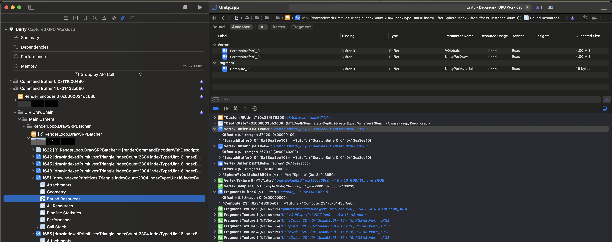

# Unity 基础知识深入展开

本文档深入解释 Unity 渲染管线相关的核心概念和基础知识，帮助理解 SRP 的实现原理。

## 目录 (Table of Contents)

- [1. Scriptable Render Pipeline 核心概念](#1-scriptable-render-pipeline-核心概念)
  - [1.1 ScriptableRenderContext 详解](#11-scriptablerendercontext-详解)
  - [1.2 CommandBuffer 生命周期管理](#12-commandbuffer-生命周期管理)
  - [1.3 CullingResults 和视锥剔除](#13-cullingresults-和视锥剔除)
  - [1.4 DrawRenderers 的参数详解](#14-drawrenderers-的参数详解)
- [2. 着色器相关基础](#2-着色器相关基础)
  - [2.1 Shader Object 的结构层次](#21-shader-object-的结构层次)
  - [2.2 SubShader 级别的属性和标签](#22-subshader-级别的属性和标签)
    - [2.2.1 Queue 标签和渲染顺序](#221-queue-标签和渲染顺序)
    - [2.2.2 RenderType 标签](#222-rendertype-标签)
    - [2.2.3 RenderPipeline 标签](#223-renderpipeline-标签)
    - [2.2.4 Shader LOD（细节层次）](#224-shader-lod细节层次)
  - [2.3 Pass 级别的属性和标签](#23-pass-级别的属性和标签)
    - [2.3.1 LightMode 标签系统](#231-lightmode-标签系统)
    - [2.3.2 ShaderTagId 的作用](#232-shadertagid-的作用)
    - [2.3.3 SRPDefaultUnlit 默认行为](#233-srpdefaultunlit-默认行为)
    - [2.3.4 传统内置管线的标签](#234-传统内置管线的标签)
  - [2.4 Shader 和 SubShader 的选择机制](#24-shader-和-subshader-的选择机制)
- [3. 材质系统深入](#3-材质系统深入)
  - [3.1 Material 资源 vs MaterialInstance](#31-material-资源-vs-materialinstance)
  - [3.2 MaterialPropertyBlock 和 PerRendererData](#32-materialpropertyblock-和-perrendererdata)
  - [3.3 属性覆盖机制](#33-属性覆盖机制)
  - [3.4 共享材质 vs 实例材质的内存考量](#34-共享材质-vs-实例材质的内存考量)
- [4. 排序和批处理](#4-排序和批处理)
  - [4.1 SortingCriteria 的选项](#41-sortingcriteria-的选项)
  - [4.2 静态批处理 vs 动态批处理](#42-静态批处理-vs-动态批处理)
  - [4.3 GPU Instancing](#43-gpu-instancing)
  - [4.4 SRP Batcher 的工作原理](#44-srp-batcher-的工作原理)
- [5. 编辑器相关](#5-编辑器相关)
  - [5.1 Partial Class 的使用](#51-partial-class-的使用)
  - [5.2 Conditional Compilation（条件编译）](#52-conditional-compilation条件编译)
  - [5.3 Editor-only 功能的设计模式](#53-editor-only-功能的设计模式)
- [6. Canvas UI 渲染模式与 SRP 集成](#6-canvas-ui-渲染模式与-srp-集成)
  - [6.1 三种渲染模式概述](#61-三种渲染模式概述)
  - [6.2 渲染流程对比](#62-渲染流程对比)
  - [6.3 与 SRP 的集成关系](#63-与-srp-的集成关系)
  - [6.4 EmitWorldGeometryForSceneView 的作用](#64-emitworldgeometryforsceneview-的作用)
  - [6.5 性能对比分析](#65-性能对比分析)
  - [6.6 使用场景建议](#66-使用场景建议)
- [7. 性能考量](#7-性能考量)
  - [7.1 Draw Call 的优化](#71-draw-call-的优化)
  - [7.2 命令缓冲区的合理使用](#72-命令缓冲区的合理使用)
  - [7.3 上下文提交的时机](#73-上下文提交的时机)
- [参考资源](#参考资源)

---

## 1. Scriptable Render Pipeline 核心概念

### 1.1 ScriptableRenderContext 详解

`ScriptableRenderContext` 是 SRP 的核心接口，所有渲染操作都通过它执行。

**核心特性：**

1. **延迟执行机制**
   - 所有命令不会立即执行，而是记录在上下文中
   - 通过 `Submit()` 一次性提交，减少状态切换开销

2. **命令记录与执行分离**
   ```csharp
   context.SetupCameraProperties(camera);  // 记录命令
   context.ClearRenderTarget(...);           // 记录命令
   context.DrawRenderers(...);                // 记录命令
   context.Submit();                          // 执行所有命令
   ```

3. **上下文状态管理**
   - 维护相机属性、渲染目标、全局着色器属性等
   - 确保命令在正确的状态下执行

**在当前项目中的使用：**

```24:39:Assets/Custom RP/Runtime/CameraRenderer.cs
    public void Render(ScriptableRenderContext context, Camera camera)
    {
        this.context = context;
        this.camera = camera;

        // Cull和GPU无关
        if (!Cull())
            return;

        Setup();

        DrawVisibleObjects();
        DrawUnsupportedShaders();
        DrawGizmos();

        Submit();
    }
```

### 1.2 CommandBuffer 生命周期管理

`CommandBuffer` 是命令记录的容器，用于批量收集渲染命令。

**生命周期：**

1. **创建**
   ```csharp
   buffer = new CommandBuffer() {
       name = bufferName  // 用于性能分析
   };
   ```

2. **记录命令**
   ```csharp
   buffer.ClearRenderTarget(true, true, Color.clear);
   buffer.BeginSample(bufferName);
   ```

3. **执行并清空**
   ```csharp
   context.ExecuteCommandBuffer(buffer);
   buffer.Clear();  // 清空以供重用
   ```

**关键设计模式：**

在当前实现中，CommandBuffer 被重用：

```76:80:Assets/Custom RP/Runtime/CameraRenderer.cs
    private void ExecuteBuffer()
    {
        context.ExecuteCommandBuffer(buffer);
        buffer.Clear();
    }
```

**为什么清空而不是重建？**
- 减少内存分配：避免每帧创建新对象
- 性能优化：对象池模式

### 1.3 CullingResults 和视锥剔除

`CullingResults` 包含剔除操作的结果，包含所有可见对象的信息。

**剔除类型：**

1. **视锥剔除（Frustum Culling）**
   - 移除相机视野外的对象
   - 基于对象的包围盒（Bounds）

2. **遮挡剔除（Occlusion Culling）**
   - 移除被其他对象完全遮挡的对象
   - 需要预计算或运行时计算

**获取剔除结果：**

```82:91:Assets/Custom RP/Runtime/CameraRenderer.cs
    private bool Cull()
    {
        if (!camera.TryGetCullingParameters(out ScriptableCullingParameters parameters))
        {
            return false;
        }

        cullingResults = context.Cull(ref parameters);
        return true;
    }
```

**CullingResults 包含的信息：**
- 可见渲染器列表
- 可见光源列表
- 遮挡数据（如果启用了遮挡剔除）

### 1.4 DrawRenderers 的参数详解

`DrawRenderers` 是实际执行渲染的核心方法：

```csharp
void DrawRenderers(
    CullingResults cullingResults,
    ref DrawingSettings drawingSettings,
    ref FilteringSettings filteringSettings
)
```

**参数说明：**

1. **cullingResults**
   - 剔除结果，包含可见对象列表
   - 必须先从 `Context.Cull()` 获取

2. **drawingSettings**
   - 指定要渲染哪些着色器 Pass
   - 包含排序设置
   - 可以指定多个 Pass（多 Pass 渲染）

3. **filteringSettings**
   - 过滤条件（队列范围、渲染类型、图层等）
   - 决定哪些对象被实际渲染

**在当前项目中的使用：**

```56:58:Assets/Custom RP/Runtime/CameraRenderer.cs
        var drawingSettings = new DrawingSettings(unlitShaderTagId, sortingSettings);
        var filteringSettings = new FilteringSettings(RenderQueueRange.opaque);
        context.DrawRenderers(cullingResults, ref drawingSettings, ref filteringSettings);
```

[↑ 返回目录](#目录-table-of-contents)

## 2. 着色器相关基础

### 2.1 Shader Object 的结构层次

Unity 的 Shader Object 采用层级结构，理解这个结构对于正确使用和调试着色器至关重要：

```text
Shader "Custom/MyShader"          // Shader Object（最外层）
├─ Properties                      // 着色器属性声明（在 Material Inspector 中显示）
│  ├─ _MainTex ("Main Texture", 2D) = "white" {}
│  └─ _Color ("Color", Color) = (1,1,1,1)
│
├─ SubShader 0                    // 第一个 SubShader（最高优先级）
│  ├─ Tags { "Queue"="Geometry", "RenderType"="Opaque" }  // SubShader 级别标签
│  ├─ LOD 300                     // SubShader 级别属性
│  ├─ Pass 0                      // Pass（渲染通道）
│  │  └─ Tags { "LightMode"="SRPDefaultUnlit" }  // Pass 级别标签
│  ├─ Pass 1                      // 另一个 Pass
│  │  └─ Tags { "LightMode"="ShadowCaster" }
│  └─ ...
│
├─ SubShader 1                    // 第二个 SubShader（备选）
│  └─ ...
│
└─ Fallback "Legacy Shaders/Diffuse"  // 如果所有 SubShader 都不兼容
```

**层级关系：**

1. **Shader Object**：顶层容器，包含所有 SubShader 和全局属性
2. **SubShader**：针对不同平台或渲染管线的实现，包含 SubShader 级别的 Tags 和属性
3. **Pass**：实际的渲染指令集合，包含 Pass 级别的 Tags 和渲染状态

**关键区别：**

| 特性 | SubShader 级别 | Pass 级别 |
|------|---------------|----------|
| **Tags 示例** | `Queue`, `RenderType`, `RenderPipeline` | `LightMode` |
| **属性示例** | `LOD` | 无属性（只有 Tags 和渲染状态） |
| **作用范围** | 影响整个 SubShader 中的所有 Pass | 只影响单个 Pass |
| **定义位置** | `SubShader { Tags { ... } }` | `Pass { Tags { ... } }` |

**重要概念：**

- **SubShader 级别的属性**：应用于该 SubShader 的所有 Pass，例如 `Queue` 决定渲染顺序，`RenderPipeline` 决定兼容性
- **Pass 级别的属性**：只应用于单个 Pass，例如 `LightMode` 决定该 Pass 在哪个渲染阶段被使用

理解这个层级结构后，我们可以更清晰地组织着色器的相关内容。

[↑ 返回目录](#目录-table-of-contents)

### 2.2 SubShader 级别的属性和标签

#### 2.2.1 Queue 标签和渲染顺序

`Queue` 标签是 SubShader 中最重要的标签之一，它决定了物体的渲染顺序。理解渲染队列对于实现正确的透明效果、优化性能和控制渲染流程至关重要。

**什么是 Render Queue？**
>>>>>>> Stashed changes

**Render Queue（渲染队列）本质上是一个整数值（int），范围通常是 0-5000**，而不是枚举类型。Unity 使用这个值来决定物体的渲染顺序：**队列值越小，越先渲染**。

```shader
SubShader
{
    // 在 SubShader 的 Tags 中定义渲染队列
    Tags { "Queue"="Geometry" }  // 默认值：2000
    
    Pass
    {
        // Pass 的代码
    }
}
```

#### Queue 的定义方式

在 Shader 中，Queue 标签支持多种定义方式：

```shader
// 方式 1：使用预定义名称（推荐，易读）
Tags { "Queue"="Geometry" }  // 等于 2000

// 方式 2：使用名称 + 偏移（常用，精细控制）
Tags { "Queue"="Geometry+100" }  // 等于 2100
Tags { "Queue"="Transparent-50" }  // 等于 2950

// 方式 3：直接使用数字（不推荐，可读性差）
Tags { "Queue"="2100" }  // 可以，但不推荐

// 方式 4：使用名称 - 偏移
Tags { "Queue"="AlphaTest-100" }  // 等于 2350
```

#### 预定义的 Queue 值

Unity 提供了 `UnityEngine.Rendering.RenderQueue` 枚举作为常用的预设值：

```csharp
namespace UnityEngine.Rendering
{
    public enum RenderQueue
    {
        Background = 1000,   // 背景（如天空盒）
        Geometry = 2000,     // 不透明几何体（默认值）
        AlphaTest = 2450,    // 透明度测试（Cutout）
        Transparent = 3000,  // 透明物体
        Overlay = 4000       // 叠加效果（如 UI）
    }
}
```

**但这些只是建议值，你可以使用 0-5000 范围内的任何整数。**

#### 完整的队列范围图谱

```text
渲染队列完整范围：

    0                    1000        2000    2450    3000        4000        5000
    │                     │           │       │       │           │           │
    ├─────────────────────┼───────────┼───────┼───────┼───────────┼───────────┤
         (很少使用)     Background  Geometry AlphaTest Transparent Overlay (极少)
                           ↓           ↓       ↓       ↓           ↓
                        天空盒     不透明物体  镂空   透明物体    UI/特效


详细分区说明：

0-999:      未定义区域（理论可用，但不推荐）
1000:       Background（天空盒、背景物体）
1001-1999:  Background 后的特殊物体
2000:       Geometry（不透明物体的标准值）
2001-2449:  不透明物体的微调范围
2450:       AlphaTest（Alpha 裁剪物体，如树叶）
2451-2999:  AlphaTest 到 Transparent 之间的过渡
3000:       Transparent（透明物体的标准值）
3001-3999:  透明物体的微调范围
4000:       Overlay（UI、全屏特效）
4001-5000:  最晚渲染的特殊效果
```

#### 渲染顺序的多级排序机制

Unity 在 `DrawRenderers` 调用时使用**多级排序**来决定最终的渲染顺序：

**排序优先级（从高到低）：**

```text
1. 【最高优先级】Render Queue (material.renderQueue)
   ↓ 如果 Queue 相同，才继续下一级排序
   
2. 【次级优先级】Sorting Layer (仅 2D，renderer.sortingLayerID)
   ↓ 如果 Sorting Layer 相同，才继续下一级排序
   
3. 【次级优先级】Order in Layer (仅 2D，renderer.sortingOrder)
   ↓ 如果 Order 相同，才继续下一级排序
   
4. 【次级优先级】SortingCriteria (DrawingSettings 中指定)
   - 距离排序（FrontToBack / BackToFront）
   - 材质优化（OptimizeStateChanges）
   - 其他排序条件
   ↓
   
5. 【最低优先级】Material Instance ID (用于批处理优化)
```

**关键点：Render Queue 是绝对优先级，Queue 不同的物体，永远按 Queue 值排序。**

#### 实际排序示例

```csharp
// 场景设置：5 个物体，不同的队列和距离
GameObject obj1 = CreateCube("Obj1", queue: 2000, z: 10);  // 远
GameObject obj2 = CreateCube("Obj2", queue: 2000, z: 5);   // 近
GameObject obj3 = CreateCube("Obj3", queue: 2100, z: 2);   // 最近
GameObject obj4 = CreateCube("Obj4", queue: 3000, z: 1);   // 超近
GameObject obj5 = CreateCube("Obj5", queue: 2100, z: 15);  // 最远

// DrawingSettings 设置
var sortingSettings = new SortingSettings(camera)
{
    criteria = SortingCriteria.CommonOpaque  // 从前往后（近到远）
};

// 排序逻辑：
// 
// 第一步：按 Render Queue 分组
// Group 1 (Queue=2000): obj1, obj2
// Group 2 (Queue=2100): obj3, obj5
// Group 3 (Queue=3000): obj4
//
// 第二步：在每组内按 SortingCriteria 排序（从前往后）
//
// 最终渲染顺序：
// 1. obj2 (Queue=2000, z=5)   ← Group 1 中较近的
// 2. obj1 (Queue=2000, z=10)  ← Group 1 中较远的
// 3. obj3 (Queue=2100, z=2)   ← Group 2 中较近的
// 4. obj5 (Queue=2100, z=15)  ← Group 2 中较远的
// 5. obj4 (Queue=3000, z=1)   ← Group 3（即使最近，但队列最高）
```

**可视化流程：**

```text
所有可见对象
    ↓
按 Render Queue 分组（最高优先级）
    ├─ Group [Queue=2000]: obj1, obj2
    │   └─ 在组内应用 SortingCriteria ↓
    │       按距离排序（近→远）: obj2 → obj1
    │
    ├─ Group [Queue=2100]: obj3, obj5
    │   └─ 在组内应用 SortingCriteria ↓
    │       按距离排序（近→远）: obj3 → obj5
    │
    └─ Group [Queue=3000]: obj4
        └─ 只有一个，无需排序
    ↓
最终渲染顺序: obj2 → obj1 → obj3 → obj5 → obj4
```

#### 为什么不透明和透明物体的渲染顺序不同？

**不透明物体（Queue < 2500）：**

```shader
SubShader
{
    Tags { "Queue"="Geometry" }  // 2000
    
    Pass
    {
        ZWrite On      // 写入深度缓冲区
        ZTest LEqual   // 深度测试：小于等于时通过
        Blend Off      // 不进行混合
    }
}
```

- **排序方式**：从前往后（近到远）
- **原因**：先渲染近的物体，利用深度测试剔除被遮挡的像素（Early-Z 优化）
- **深度写入**：开启（ZWrite On）

**透明物体（Queue >= 2500）：**

```shader
SubShader
{
    Tags { "Queue"="Transparent" }  // 3000
    
    Pass
    {
        ZWrite Off     // 不写入深度缓冲区
        ZTest LEqual   // 深度测试：小于等于时通过（只读取）
        Blend SrcAlpha OneMinusSrcAlpha  // Alpha 混合
    }
}
```

- **排序方式**：从后往前（远到近）
- **原因**：Alpha 混合需要正确的颜色叠加顺序，后面的物体先渲染，前面的物体后渲染
- **深度写入**：关闭（ZWrite Off），避免遮挡后面的透明物体

**为什么透明物体要从后往前渲染？**

```text
错误的顺序（从前往后）：
1. 渲染近的透明物体 A（alpha=0.5，红色）
2. 渲染远的透明物体 B（alpha=0.5，蓝色）
   → 由于 A 已经在前面，B 的深度测试可能失败
   → 结果：只看到红色，看不到蓝色 ❌

正确的顺序（从后往前）：
1. 渲染远的透明物体 B（alpha=0.5，蓝色）
2. 渲染近的透明物体 A（alpha=0.5，红色）
   → A 通过 Alpha 混合叠加在 B 上
   → 结果：看到紫色（红+蓝混合）✅
```

#### Material 可以覆盖 Shader 的默认 Queue

**重要特性：Material 实例可以覆盖 Shader 中定义的默认队列值。**

```csharp
// Shader 中定义的默认值
Shader "Custom/MyShader"
{
    SubShader
    {
        Tags { "Queue"="Geometry" }  // 默认 2000
    }
}

// C# 代码中覆盖
Material mat = GetComponent<Renderer>().material;

// 读取队列值的优先级：
// 1. 如果 Material 有自定义的 renderQueue，使用它
// 2. 否则，使用 Shader 中定义的默认 Queue

// 初始时继承 Shader 的默认值
Debug.Log(mat.renderQueue);  // 2000

// 在 Material 上覆盖
mat.renderQueue = 2050;
Debug.Log(mat.renderQueue);  // 2050

// 重置回 Shader 的默认值
mat.renderQueue = -1;  // 特殊值 -1 表示"使用 Shader 默认值"
Debug.Log(mat.renderQueue);  // 2000（回到 Shader 默认值）
```

**在 Unity Editor 中：**

URP 的 Lit Shader 会在 Inspector 中根据 Surface Type 自动调整队列值：

```text
┌─────────────────────────────────────────┐
│ Surface Type: Opaque                     │
│   └─ renderQueue = 2000                  │
│                                          │
│ [改为 Transparent]                       │
│                                          │
│ Surface Type: Transparent                │
│   └─ renderQueue = 3000 (自动改变！)     │
│                                          │
│ [开启 Alpha Clipping]                    │
│                                          │
│ Surface Type: Opaque                     │
│ Alpha Clipping: ON                       │
│   └─ renderQueue = 2450 (自动改变！)     │
└─────────────────────────────────────────┘
```

这是通过 ShaderGUI 脚本在编辑器中修改 `material.renderQueue` 实现的。

#### 实际应用场景

**场景 1：透明物体的排序问题**

```shader
// 问题：多个透明窗户重叠，显示不正确
SubShader
{
    Tags { "Queue"="Transparent" }  // 都是 3000
    // 所有窗户的队列值相同，排序可能不正确
}

// 解决方案：为每个窗户分配不同的队列值
// 在 C# 中动态调整
void Start()
{
    Material[] materials = GetComponentsInChildren<Renderer>()
        .Select(r => r.material)
        .ToArray();
    
    for (int i = 0; i < materials.Length; i++)
    {
        // 根据深度或顺序分配队列值
        materials[i].renderQueue = 3000 + i;
    }
}
```

**场景 2：特殊效果需要在特定时机渲染**

```shader
// 场景 A：力场效果，需要在所有不透明物体之后，透明物体之前
SubShader
{
    Tags { "Queue"="Geometry+500" }  // 2500
    // 在不透明和透明之间
}

// 场景 B：全屏特效，需要在所有物体之后
SubShader
{
    Tags { "Queue"="Overlay+100" }  // 4100
    // 最后渲染
}
```

**场景 3：优化不透明物体的渲染顺序**

```shader
// 大型不透明物体，希望最先渲染（可能遮挡很多物体）
SubShader
{
    Tags { "Queue"="Geometry-100" }  // 1900
    // 比普通物体更早渲染，利用 Early-Z 优化
}
```

#### Queue 与 FilteringSettings 的关系

在自定义渲染管线中，`FilteringSettings` 使用队列范围来过滤要渲染的物体：

```csharp
// FilteringSettings 只是过滤，不修改队列值

var filteringSettings = new FilteringSettings(RenderQueueRange.opaque);
// 这只会过滤出 renderQueue < 2500 的物体

// 例如场景中有：
// 物体 A: renderQueue = 2000  ← 会被渲染
// 物体 B: renderQueue = 2200  ← 会被渲染
// 物体 C: renderQueue = 3000  ← 被过滤掉，不渲染

context.DrawRenderers(
    cullingResults, 
    ref drawingSettings, 
    ref filteringSettings  // ← 只过滤，不修改 renderQueue
);
```

**预定义的队列范围：**

```csharp
// Unity 提供的预定义范围
RenderQueueRange.opaque       // 0 - 2500（不透明物体）
RenderQueueRange.transparent  // 2501 - 5000（透明物体）
RenderQueueRange.all          // 0 - 5000（所有物体）

// 自定义范围
var customRange = new RenderQueueRange(2000, 3000);  // 自定义范围
```

#### 最佳实践

1. **使用预定义名称 + 偏移量**
   ```shader
   // 好的做法
   Tags { "Queue"="Transparent+10" }
   
   // 不推荐
   Tags { "Queue"="3010" }  // 缺乏语义
   ```

2. **不透明物体使用 Geometry 队列**
   ```shader
   Tags { "Queue"="Geometry" }  // 2000
   ```

3. **透明物体使用 Transparent 队列**
   ```shader
   Tags { "Queue"="Transparent" }  // 3000
   ```

4. **Alpha 裁剪使用 AlphaTest 队列**
   ```shader
   Tags { "Queue"="AlphaTest" }  // 2450
   ```

5. **需要精细控制时，动态调整 Material 的 renderQueue**
   ```csharp
   material.renderQueue = (int)RenderQueue.Transparent + sortOrder;
   ```

6. **避免大量物体使用相同的队列值**
   - 如果有很多透明物体重叠，考虑动态分配不同的队列值
   - 或使用 Sorting Layer 和 Order in Layer（2D）

#### 常见问题

**Q: 为什么我的透明物体显示不正确？**

A: 检查以下几点：
- 确保使用 `Queue="Transparent"` 或更高的值（>= 3000）
- 确保 `ZWrite Off`（透明物体不写入深度）
- 确保使用了正确的 Blend 模式
- 如果有多个透明物体重叠，考虑手动排序

**Q: Render Queue 和 SortingCriteria 的关系？**

A: Render Queue 是最高优先级的排序条件，SortingCriteria 只在相同 Queue 的物体之间起作用。

**Q: 可以使用负数的队列值吗？**

A: 技术上可以，但不推荐。-1 是特殊值，表示"使用 Shader 默认值"。

**Q: 为什么我修改了 Shader 的 Queue，但 Material 没有变化？**

A: Material 可能已经有了自定义的 renderQueue 值。将 `material.renderQueue = -1` 可以重置为 Shader 默认值。

[↑ 返回目录](#目录-table-of-contents)

#### 2.2.2 RenderType 标签

`RenderType` 标签用于对对象进行分类，通常用于后处理或替换着色器：

```shader
Tags { 
    "RenderType"="Opaque"
    // 或 "Transparent", "Cutout" 等
}
```

**设计目的：**

`RenderType` 标签的主要设计目的是为不同类型的渲染对象提供分类标识，使得渲染管线可以根据对象的类型进行特定的处理或优化。这个标签在 Unity 的渲染系统中起到了以下关键作用：

1. **对象分类**：提供统一的分类系统，让所有着色器都能标识自己渲染的对象类型
2. **着色器替换支持**：为 Camera 的 Shader Replacement 功能提供匹配依据
3. **后处理系统集成**：后处理效果可以根据 RenderType 选择性地处理不同类型的对象
4. **调试和可视化**：开发工具可以根据 RenderType 进行特定的可视化渲染

**常见 RenderType 值：**

Unity 内置着色器使用以下标准值（遵循 Unity 的命名约定，有助于与系统功能兼容）：

| RenderType 值 | 说明 | 典型用途 |
|--------------|------|---------|
| `Opaque` | 不透明对象 | 大部分不透明着色器（如 Standard、Diffuse、Normal、Terrain） |
| `Transparent` | 透明对象 | 半透明着色器（如 Transparent、Particles、Font） |
| `TransparentCutout` | 透明度裁剪对象 | 镂空着色器（如 Transparent/Cutout、Two-sided vegetation） |
| `Background` | 背景对象 | 天空盒着色器（Skybox） |
| `Overlay` | 叠加效果 | UI 效果、光环（Halo）、光晕（Flare）着色器 |

**自定义 RenderType 值：**

你也可以定义自己的 RenderType 值，但建议保持与 Unity 内置值的语义一致，以便与第三方工具兼容：

```shader
// 自定义 RenderType 值
Tags { "RenderType"="CustomOpaque" }
Tags { "RenderType"="Effect" }
Tags { "RenderType"="Water" }
```

**Shader Replacement 的工作原理：**

Shader Replacement 是 Unity 提供的功能，允许在运行时将所有或特定类型的对象替换为指定的着色器。这在内置渲染管线和 SRP 中都可以使用。

**API 使用：**

```csharp
// 方式 1：SetReplacementShader（持续替换，直到调用 ResetReplacementShader）
camera.SetReplacementShader(replacementShader, "RenderType");
camera.ResetReplacementShader();  // 恢复正常渲染

// 方式 2：RenderWithShader（仅渲染一次，不改变相机的默认行为）
camera.RenderWithShader(replacementShader, "RenderType");
```

**工作原理（详细步骤）：**

当调用 `Camera.SetReplacementShader(replacementShader, "RenderType")` 时，Unity 的渲染流程会发生以下变化：

```text
渲染每个对象时：
1. 检查对象的原始 Shader 是否有 "RenderType" 标签
   ├─ 如果没有 → 跳过渲染该对象
   └─ 如果有 → 继续步骤 2

2. 获取原始 Shader 的 RenderType 值（例如 "Opaque"）

3. 在 replacementShader 中搜索 SubShader：
   ├─ 查找 SubShader，其 Tags 中包含 "RenderType"="Opaque"
   ├─ 如果找到匹配的 SubShader → 使用该 SubShader 渲染
   └─ 如果没找到 → 跳过渲染该对象

4. 如果 replacementTag 为空字符串：
   └─ 所有对象都使用 replacementShader 渲染（忽略 RenderType）
```

**替换着色器的结构：**

替换着色器必须为每种要替换的 RenderType 提供对应的 SubShader：

```shader
Shader "Custom/ReplacementShader"
{
    // 替换 "RenderType"="Opaque" 的对象
    SubShader
    {
        Tags { "RenderType"="Opaque" }
        Pass
        {
            // 替换着色器的渲染逻辑（例如只渲染深度、法线等）
            CGPROGRAM
            #pragma vertex vert
            #pragma fragment frag
            // ...
            ENDCG
        }
    }
    
    // 替换 "RenderType"="Transparent" 的对象
    SubShader
    {
        Tags { "RenderType"="Transparent" }
        Pass
        {
            // 透明对象的替换逻辑
            // ...
        }
    }
    
    // 如果没有匹配的 SubShader，对象不会被渲染
}
```

**在 SRP 中的使用：**

在 Scriptable Render Pipeline 中，Shader Replacement 仍然可以使用，但需要手动处理。SRP 不像内置管线那样自动支持 `SetReplacementShader`，需要在渲染循环中实现：

```csharp
// 在 CameraRenderer 中实现
public partial class CameraRenderer
{
    private void DrawVisibleObjects()
    {
        // 如果设置了替换着色器
        if (replacementShader != null && replacementTag != null)
        {
            // 使用替换着色器绘制
            var drawingSettings = new DrawingSettings(
                new ShaderTagId("SRPDefaultUnlit"),
                new SortingSettings(camera)
            )
            {
                overrideShader = replacementShader,
                overrideShaderPassIndex = 0
            };
            
            // 根据 RenderType 过滤对象（需要自定义实现）
            var filteringSettings = new FilteringSettings(RenderQueueRange.all);
            context.DrawRenderers(cullingResults, ref drawingSettings, ref filteringSettings);
        }
        else
        {
            // 正常渲染
        }
    }
}
```

**注意事项：**

1. **性能影响**：Shader Replacement 会增加渲染开销，因为它需要额外的 Shader 查找和匹配
2. **兼容性**：确保替换着色器为所有需要的 RenderType 提供了 SubShader
3. **材质属性**：替换着色器可能无法访问原始材质的某些属性（取决于替换着色器的实现）
4. **SRP 支持**：在 SRP 中，Shader Replacement 的支持程度取决于渲染管线的实现

**最佳实践：**

1. **遵循命名约定**：使用 Unity 标准的 RenderType 值（Opaque、Transparent 等）
2. **提供完整的替换**：为替换着色器提供所有可能遇到的 RenderType 的 SubShader
3. **及时重置**：在不需要时调用 `ResetReplacementShader()` 恢复正常渲染
4. **性能考虑**：只在需要时启用替换着色器（如调试模式、特殊效果）

#### 2.2.3 RenderPipeline 标签

`RenderPipeline` 标签用于指定该 SubShader 兼容的渲染管线，这是 SRP 中最重要的 SubShader 级别标签之一。

**定义方式：**

```shader
SubShader
{
    // SRP 兼容标签（URP）
    Tags { "RenderPipeline"="UniversalRenderPipeline" }
    
    Pass
    {
        // ...
    }
}
```

**常见值：**

- `"RenderPipeline"="UniversalRenderPipeline"`：兼容 URP
- `"RenderPipeline"="HDRenderPipeline"`：兼容 HDRP
- `"RenderPipeline"=""` 或不设置：兼容内置渲染管线

**工作原理：**

Unity 在选择 SubShader 时，会检查 `RenderPipeline` 标签是否与当前使用的渲染管线匹配：
- 如果匹配，该 SubShader 会被考虑
- 如果不匹配，该 SubShader 会被跳过，继续查找下一个 SubShader

**实际示例：**

```shader
Shader "Custom/ExampleShader"
{
    // SubShader 0：针对 URP
    SubShader
    {
        Tags { "RenderPipeline"="UniversalRenderPipeline" }
        Pass
        {
            Tags { "LightMode"="UniversalForward" }
            // ...
        }
    }
    
    // SubShader 1：针对内置管线
    SubShader
    {
        Tags { "RenderPipeline"="" }  // 或省略此标签
        Pass
        {
            Tags { "LightMode"="ForwardBase" }
            // ...
        }
    }
}
```

**在当前项目中的应用：**

我们的自定义渲染管线不要求特定的 `RenderPipeline` 标签（因为没有设置），因此可以兼容没有设置此标签的 Shader。

#### 2.2.4 Shader LOD（细节层次）

Shader LOD（Level of Detail）是一种优化技术，允许 Unity 根据当前设置自动选择不同复杂度的 SubShader。这类似于 3D 模型的 LOD，但应用于着色器。

**设计目的：**

根据 [Unity 官方文档](https://docs.unity3d.com/Manual/SL-ShaderLOD.html)，Shader LOD 的设计目的是：

1. **性能优化**：在低端设备或需要性能优化的场景中，自动使用简化版本的着色器
2. **质量分级**：为不同性能需求的场景提供不同质量的着色器变体
3. **自动降级**：无需手动切换材质，Unity 会根据全局 LOD 设置自动选择合适的 SubShader
4. **节省资源**：避免在低端设备上使用过于复杂的着色器，减少 GPU 负担

**使用方式：**

在 ShaderLab 中，通过 `LOD` 指令为 SubShader 分配 LOD 值：

```shader
Shader "Custom/MyShader"
{
    // SubShader 0：高质量（LOD 300）
    SubShader
    {
        LOD 300
        Pass
        {
            // 复杂的着色器代码（法线贴图、高光等）
        }
    }
    
    // SubShader 1：中等质量（LOD 200）
    SubShader
    {
        LOD 200
        Pass
        {
            // 中等复杂度的着色器代码
        }
    }
    
    // SubShader 2：低质量（LOD 100）
    SubShader
    {
        LOD 100
        Pass
        {
            // 简化的着色器代码（无光照、基础纹理）
        }
    }
}
```

**LOD 值的选择：**

Unity 内置着色器的 LOD 值参考：

| LOD 值 | 内置着色器示例 |
|--------|---------------|
| 100 | Unlit/Texture, Unlit/Color, Unlit/Transparent |
| 300 | Standard, Standard (Specular Setup) |

传统着色器的 LOD 值：

| LOD 值 | 传统着色器示例 |
|--------|---------------|
| 100 | VertexLit |
| 200 | Diffuse |
| 300 | Bumped, Specular |
| 400-600 | Bumped Specular, Parallax 等高级特性 |

**设置全局 LOD：**

可以通过代码设置全局 Shader LOD：

```csharp
// 设置全局最大 LOD（所有 Shader 的 LOD 上限）
Shader.globalMaximumLOD = 200;

// 设置特定 Shader 的 LOD
Shader shader = Shader.Find("Custom/MyShader");
shader.maximumLOD = 300;
```

**LOD 的工作原理：**

```text
渲染物体时：
1. Unity 获取当前全局 LOD 值（例如 200）
2. 遍历 Shader 的 SubShader（按顺序）
3. 对于每个 SubShader：
   - 检查 SubShader 的 LOD 值
   - 如果 SubShader.LOD > 当前全局 LOD，跳过此 SubShader
   - 如果 SubShader.LOD <= 当前全局 LOD，检查兼容性
4. 选择第一个兼容且 LOD 值合适的 SubShader
```

**实际示例：**

```shader
Shader "Custom/AdaptiveShader"
{
    // 高质量版本：适用于高端设备
    SubShader
    {
        LOD 400
        Tags { "RenderPipeline"="UniversalRenderPipeline" }
        Pass
        {
            // 包含法线贴图、高光、阴影等完整功能
        }
    }
    
    // 中质量版本：适用于中端设备
    SubShader
    {
        LOD 200
        Tags { "RenderPipeline"="UniversalRenderPipeline" }
        Pass
        {
            // 基础光照，无法线贴图
        }
    }
    
    // 低质量版本：适用于低端设备或性能优化场景
    SubShader
    {
        LOD 100
        Tags { "RenderPipeline"="UniversalRenderPipeline" }
        Pass
        {
            // 最简单的无光照着色器
        }
    }
    
    Fallback "Universal Render Pipeline/Unlit"
}
```

**在不同 LOD 设置下的表现：**

| 全局 LOD | 选择的 SubShader | 说明 |
|---------|----------------|------|
| 400 | SubShader 0 (LOD 400) | 使用最高质量版本 |
| 200 | SubShader 1 (LOD 200) | 使用中等质量版本（LOD 400 的被跳过） |
| 100 | SubShader 2 (LOD 100) | 使用低质量版本（前两个被跳过） |
| 50 | Fallback Shader | 所有 SubShader 的 LOD 都太高，使用 Fallback |

**应用场景：**

1. **移动设备优化**：
   ```csharp
   #if UNITY_ANDROID || UNITY_IOS
       Shader.globalMaximumLOD = 200;  // 移动设备使用中等质量
   #else
       Shader.globalMaximumLOD = 400;  // PC 使用高质量
   #endif
   ```

2. **性能模式**：
   ```csharp
   // 用户选择"性能模式"
   if (qualitySettings == QualityLevel.Low) {
       Shader.globalMaximumLOD = 100;  // 使用低质量着色器
   }
   ```

3. **距离降级**：
   ```csharp
   // 根据相机距离自动降级（需要自定义实现）
   float distance = Vector3.Distance(camera.transform.position, objectPosition);
   if (distance > 100) {
       Shader.globalMaximumLOD = 100;  // 远距离使用简化着色器
   }
   ```

**最佳实践：**

1. **合理设置 LOD 值**：参考 Unity 内置着色器的 LOD 值，保持一致性
2. **提供多个 LOD 级别**：至少提供高质量和低质量两个版本
3. **保持视觉一致性**：不同 LOD 级别应该看起来相似，只是复杂度不同
4. **测试不同平台**：在不同性能的设备上测试 LOD 设置
5. **配合 Unity 的 Quality Settings**：可以考虑在 Quality Settings 中根据质量级别设置不同的 LOD

**注意事项：**

- LOD 值只是过滤条件之一，Unity 还会考虑其他兼容性因素（平台、渲染管线等）
- LOD 是基于 SubShader 的，不是基于 Pass 的
- 如果不设置 LOD，SubShader 的默认 LOD 值是无限大（总是可用）
- LOD 值越大，表示着色器越复杂、质量越高

[↑ 返回目录](#目录-table-of-contents)

### 2.3 Pass 级别的属性和标签

Pass 级别的标签和属性只影响单个 Pass，不会影响整个 SubShader。

#### 2.3.1 LightMode 标签系统

`LightMode` 标签是着色器 Pass 最重要的标签之一，用于告诉渲染管线在哪个渲染阶段使用该 Pass。

**SRP 中的 LightMode 值：**

1. **SRPDefaultUnlit**
   - 默认的无光照 Pass
   - 如果 Pass 没有声明 `LightMode`，默认使用此值
   - 用于不受光照影响的对象

2. **其他常见值（URP/HDRP 中）：**
   - `UniversalForward`：前向渲染的主 Pass
   - `ShadowCaster`：阴影投射 Pass
   - `DepthOnly`：仅深度 Pass
   - `Meta`：光照贴图烘焙 Pass

**在当前项目中的使用：**

```9:9:Assets/Custom RP/Runtime/CameraRenderer.cs
    private static ShaderTagId unlitShaderTagId = new ShaderTagId("SRPDefaultUnlit");
```

这告诉渲染管线只渲染带有 `SRPDefaultUnlit` 标签的 Pass（或未声明 LightMode 的 Pass）。

#### 2.3.2 ShaderTagId 的作用

**ShaderTagId（着色器标签 ID）：**

- 用于标识着色器的 **Pass 标签**（如 `LightMode`）
- 告诉渲染管线在什么时候使用哪个 Pass
- 在 `ShaderLab` 的 `Pass Tags` 中定义

```shader
Pass
{
    Tags { "LightMode"="SRPDefaultUnlit" }
    // ...
}
```

**Shader 关键字（Keywords）的区别：**

Shader Keywords 用于控制着色器的编译变体，在运行时通过 `Material.EnableKeyword()` 启用，用于实现条件编译（如 `#ifdef`）：

```hlsl
#pragma multi_compile _ DIRECTIONAL_LIGHT
#if defined(DIRECTIONAL_LIGHT)
    // 方向光相关代码
#endif
```

**关键区别：**

| 特性 | ShaderTagId | Shader Keywords |
|------|-------------|----------------|
| 用途 | 标识 Pass | 控制编译变体 |
| 定义位置 | Pass Tags | #pragma 指令 |
| 运行时控制 | 由渲染管线控制 | 由 Material 控制 |
| 数量限制 | 无（但有限制） | 有数量限制 |

#### 2.3.3 SRPDefaultUnlit 默认行为

**重要特性：**

1. **隐式识别**
   - 如果着色器 Pass 没有显式声明 `LightMode`，Unity SRP 会将其视为 `SRPDefaultUnlit`
   - 这在 Frame Debugger 中显示为 `LightMode: -`

2. **向后兼容**
   - 允许旧着色器在没有修改的情况下在 SRP 中工作
   - 简化了从内置管线迁移的过程

3. **默认匹配**
   - 当使用 `ShaderTagId("SRPDefaultUnlit")` 创建 `DrawingSettings` 时
   - 会渲染所有显式声明 `SRPDefaultUnlit` 的 Pass
   - **以及**所有未声明 `LightMode` 的 Pass

#### 2.3.4 传统内置管线的标签

内置渲染管线使用不同的 Pass [标签系统](https://docs.unity3d.com/2022.3/Documentation/Manual/shader-predefined-pass-tags-built-in.html)：

```16:28:Assets/Custom RP/Runtime/CameraRenderer.Editor.cs
    static ShaderTagId[] legacyShaderTagIds = {
        new ShaderTagId("Always"),
        new ShaderTagId("ForwardBase"),
        new ShaderTagId("ForwardAdd"),
        new ShaderTagId("Deferred"),
        new ShaderTagId("ShadowCaster"),
        // TODO1 打开绘制失效
        //new ShaderTagId("MotionVectors"),
        new ShaderTagId("Vertex"),
        new ShaderTagId("VertexLMRGBM"),
        new ShaderTagId("VertexLM"),
        new ShaderTagId("Meta")
    };
```

**常见内置管线标签：**

- **ForwardBase**：前向渲染的基础 Pass（主方向光）
- **ForwardAdd**：前向渲染的附加 Pass（其他光源）
- **Deferred**：延迟渲染 Pass
- **ShadowCaster**：阴影投射 Pass
- **Always**：总是渲染的 Pass
- **Meta**：光照贴图烘焙 Pass

**处理不支持的着色器：**

```31:49:Assets/Custom RP/Runtime/CameraRenderer.Editor.cs
    static Material errorMaterial;
    private partial void DrawUnsupportedShaders()
    {
        if (errorMaterial == null)
        {
            errorMaterial = new Material(Shader.Find("Hidden/InternalErrorShader"));
        }

        var drawingSettings = new DrawingSettings(legacyShaderTagIds[0], new SortingSettings(camera))
        {
            overrideMaterial = errorMaterial
        };
        for (int index=1; index<legacyShaderTagIds.Length; index++)
        {
            drawingSettings.SetShaderPassName(index, legacyShaderTagIds[index]);
        }

        var filterSettings = FilteringSettings.defaultValue;
        context.DrawRenderers(cullingResults, ref drawingSettings, ref filterSettings);
    }
```

使用 `overrideMaterial` 将所有不支持的着色器替换为错误材质（粉红色），便于在编辑器中识别问题。

[↑ 返回目录](#目录-table-of-contents)

### 2.4 Shader 和 SubShader 的选择机制

当渲染一个物体时，Unity 需要从 Shader Object 中选择合适的 SubShader 和 Pass。理解这个选择机制对于调试着色器问题和优化渲染性能至关重要。

**Unity 选择 SubShader 的过程：**

根据 [Unity 官方文档](https://docs.unity3d.com/Manual/shader-loading.html#selecting-subshaders)，Unity 按照以下步骤选择 SubShader：

**第一步：检查兼容性**

Unity 会检查每个 SubShader 是否兼容：
1. **平台硬件**：GPU 能力、特性级别
2. **Shader LOD**：当前设置的 Shader 细节层次（见 [2.2.4 Shader LOD](#224-shader-lod细节层次)）
3. **渲染管线**：`RenderPipeline` 标签是否匹配（见 [2.2.3 RenderPipeline 标签](#223-renderpipeline-标签)）

**第二步：按顺序搜索**

Unity 按照以下顺序搜索兼容的 SubShader：
1. 当前 Shader 的 SubShader（按在 Shader 中的顺序）
2. Fallback Shader 的 SubShader（如果当前 Shader 没有兼容的）

**第三步：选择第一个兼容的 SubShader**

Unity 选择**第一个**兼容的 SubShader，然后在该 SubShader 中选择合适的 Pass。

**Pass 的选择：**

选择了 SubShader 后，Unity 会根据 `DrawingSettings` 中的 `ShaderTagId` 选择 Pass（见 [2.3.1 LightMode 标签系统](#231-lightmode-标签系统)）：

```csharp
// 在当前项目中
var drawingSettings = new DrawingSettings(
    new ShaderTagId("SRPDefaultUnlit"),  // 指定要使用的 Pass 标签
    sortingSettings
);
```

Unity 会：
1. 在选定的 SubShader 中搜索带有 `LightMode="SRPDefaultUnlit"` 标签的 Pass
2. 如果找到，使用该 Pass
3. 如果没找到，尝试使用 SubShader 中的第一个 Pass（如果未声明 LightMode，会被视为 SRPDefaultUnlit）

**调试技巧：**

1. **Frame Debugger**：查看实际使用的 Shader 和 Pass
2. **Shader Inspector**：在 Unity 编辑器中查看编译后的 Shader 变体
3. **Profiler 标记**：
   - `Shader.ParseThreaded`：多线程解析 Shader
   - `Shader.ParseMainThread`：主线程解析 Shader
   - `Shader.MainThreadCleanup`：清理 Shader 变体

**常见问题：**

1. **物体显示为粉红色**：
   - 说明没有找到兼容的 SubShader
   - 检查 SubShader 的 Tags 是否与渲染管线匹配
   - 检查 GPU 能力是否支持

2. **使用了错误的 SubShader**：
   - 检查 SubShader 的顺序（Unity 选择第一个兼容的）
   - 检查 Shader LOD 设置

3. **Fallback 被使用**：
   - 说明当前 Shader 的所有 SubShader 都不兼容
   - 考虑添加更通用的 SubShader 或调整 Tags

**最佳实践：**

1. **提供多个 SubShader**：为不同的平台和渲染管线提供兼容的 SubShader
2. **合理排序**：将最常用、最兼容的 SubShader 放在前面
3. **使用 Fallback**：始终提供 Fallback Shader 作为最后备选
4. **明确标签**：为每个 SubShader 明确设置 `RenderPipeline` 等标签

>>>>>>> Stashed changes
[↑ 返回目录](#目录-table-of-contents)

## 3. 材质系统深入

### 3.1 Material 资源 vs MaterialInstance

**Material 资源：**
- 存储在磁盘上的资源文件（.mat）
- 可以被多个对象共享
- 修改会影响所有使用该材质的对象

**Material Instance（运行时创建）：**
- 在运行时通过 `Material` 构造函数创建
- 每个实例独立，修改不影响原始材质
- 内存开销较大

**代码示例：**
```csharp
// Material 资源（共享）
Material sharedMaterial = GetComponent<Renderer>().sharedMaterial;

// Material 实例（独立）
Material instance = new Material(sharedMaterial);
GetComponent<Renderer>().material = instance;  // 自动创建实例
```

### 3.2 MaterialPropertyBlock 和 PerRendererData

**MaterialPropertyBlock：**

允许每个渲染器实例有不同的属性值，而无需创建新的 Material 实例。

**优势：**
- 内存效率：共享同一个 Material，只存储差异
- 性能优化：支持批量渲染（SRP Batcher）
- 动态修改：运行时修改属性不影响其他对象

**使用示例：**
```csharp
MaterialPropertyBlock mpb = new MaterialPropertyBlock();
mpb.SetColor("_Color", Color.red);
mpb.SetTexture("_MainTex", customTexture);
renderer.SetPropertyBlock(mpb);
```

**PerRendererData 属性：**

在着色器中标记为 `[PerRendererData]` 的属性，表示该属性的值来自 `MaterialPropertyBlock`：

```hlsl
Properties
{
    _MainTex ("Main Texture", 2D) = "white" {}
    [PerRendererData] _CustomTex ("Custom Texture", 2D) = "black" {}
}
```

**设计目的：**

`[PerRendererData]` 属性标签的设计目的是为了明确标识哪些着色器属性应该通过 `MaterialPropertyBlock` 来设置，而不是在 Material 资源中设置。这样做的好处包括：

1. **明确语义**：告诉开发者这个属性是为每个渲染器实例单独设置的，不应该在 Material 资源中编辑
2. **编辑器提示**：Material Inspector 会将这些属性显示为只读，避免误操作
3. **优化提示**：Unity 可以识别这些属性，更好地进行批量渲染优化（如 SRP Batcher）
4. **文档化意图**：代码即文档，清晰地表达了属性的使用方式

**使用场景举例：**

**场景 1：大量相同物体的差异化渲染（如草地、树木）**

```csharp
// 使用相同的 Material，但每个草地的纹理不同
Shader shader = Shader.Find("Custom/GrassShader");
Material sharedMaterial = new Material(shader);

for (int i = 0; i < grassCount; i++)
{
    GameObject grass = Instantiate(grassPrefab);
    Renderer renderer = grass.GetComponent<Renderer>();
    
    // 共享同一个 Material，只通过 MaterialPropertyBlock 设置纹理差异
    MaterialPropertyBlock mpb = new MaterialPropertyBlock();
    mpb.SetTexture("_GrassTexture", grassTextures[i]);  // PerRendererData 属性
    mpb.SetColor("_TintColor", grassColors[i]);         // PerRendererData 属性
    renderer.SetPropertyBlock(mpb);
}
```

**优势：** 1000 个草地对象共享 1 个 Material，只有 1000 个小的 MaterialPropertyBlock，而不是 1000 个完整的 Material 实例。

**场景 2：Sprite 渲染器（UI、2D 游戏）**

在 Unity 的 UGUI 和 2D Sprite 系统中，每个 Image 或 SpriteRenderer 通常使用相同的 Material，但通过 MaterialPropertyBlock 设置不同的纹理：

```csharp
// UGUI Image 组件的内部实现（简化版）
MaterialPropertyBlock mpb = new MaterialPropertyBlock();
mpb.SetTexture("_MainTex", sprite.texture);  // PerRendererData 属性
image.rectTransform.GetComponent<CanvasRenderer>().SetMaterialPropertyBlock(mpb);
```

**优势：** 大量 UI 元素可以共享同一个 Material，减少内存占用和提高批处理效率。

**场景 3：程序化生成的网格（地形系统）**

在程序化生成的地形系统中，不同的地形块使用相同的着色器，但纹理细节不同：

```csharp
// 地形块渲染
Material terrainMaterial = terrainShaderMaterial;

foreach (TerrainChunk chunk in terrainChunks)
{
    Renderer chunkRenderer = chunk.GetComponent<Renderer>();
    MaterialPropertyBlock mpb = new MaterialPropertyBlock();
    
    // 每个地形块有不同的纹理混合权重
    mpb.SetFloat("_TextureWeight1", chunk.textureWeight1);  // PerRendererData
    mpb.SetFloat("_TextureWeight2", chunk.textureWeight2);  // PerRendererData
    mpb.SetTexture("_DetailTex", chunk.detailTexture);      // PerRendererData
    
    chunkRenderer.SetPropertyBlock(mpb);
}
```

**优势：** 地形系统可以高效地渲染大量地形块，同时保持每个块的视觉差异。

**场景 4：粒子系统中的自定义属性**

在粒子系统中，可以为每个粒子设置不同的属性：

```csharp
// 粒子渲染（简化示例）
Material particleMaterial = particleSystemMaterial;

for (int i = 0; i < particleCount; i++)
{
    Particle particle = particles[i];
    
    // 每个粒子的颜色和大小可能不同
    MaterialPropertyBlock mpb = new MaterialPropertyBlock();
    mpb.SetColor("_Color", particle.color);           // PerRendererData
    mpb.SetFloat("_Size", particle.size);             // PerRendererData
    mpb.SetTexture("_NoiseTex", particle.noiseTexture); // PerRendererData
    
    // 渲染粒子...
}
```

**特性：**
- 在 Material Inspector 中显示为只读
- 值存储在 `MaterialPropertyBlock` 中，不在 Material 资源中
- 支持批量渲染优化（SRP Batcher、GPU Instancing）
- 明确标识该属性的使用方式和设计意图

**驱动层的批处理效率提升：**

从 GPU 驱动层的角度来看，MaterialPropertyBlock 提升批处理效率的核心在于**减少驱动层状态切换的开销**：

**1. Material 实例在驱动层的操作（传统方式）**

使用 Material 实例时，每次切换 Material 都需要在驱动层执行大量操作：

```cpp
// 驱动层视角：使用 Material 实例
void Driver_SetMaterial(Material* mat) {
    // 1. 验证 Shader 兼容性
    if (currentShader != mat->shader) {
        vkCmdBindPipeline(cmdBuffer, VK_PIPELINE_BIND_POINT_GRAPHICS, mat->pipeline);
        // 驱动层需要：验证 pipeline 状态、切换 pipeline 状态机
    }
    
    // 2. 更新所有纹理绑定（每个纹理都需要驱动调用）
    for (each texture in mat->textures) {
        vkUpdateDescriptorSets(device, 
            &writeDescriptorSet,  // 需要驱动层验证描述符
            1, nullptr);
        // 驱动层需要：
        // - 验证纹理格式兼容性
        // - 检查纹理状态（是否需要过渡）
        // - 更新 GPU 内存映射
    }
    
    // 3. 更新所有 Uniform Buffer（每个属性）
    vkMapMemory(device, mat->uniformBufferMemory, ...);
    memcpy(mappedData, mat->properties, mat->propertySize);
    vkUnmapMemory(device, mat->uniformBufferMemory);
    // 驱动层需要：
    // - 内存映射/解映射（用户态 ↔ 内核态）
    // - GPU 内存同步
    // - 缓存失效处理
    
    // 4. 更新 Descriptor Set（驱动层状态验证）
    vkCmdBindDescriptorSets(cmdBuffer, ..., mat->descriptorSet);
    // 驱动层需要：
    // - 验证描述符集有效性
    // - 检查资源绑定状态
    // - 更新 GPU 命令缓冲区的状态
}
```

**开销分析：**
- 每次切换：~10-50 个驱动层 API 调用
- 驱动层验证：资源状态检查、内存映射、同步操作
- CPU ↔ GPU 通信：每次切换都需要内核态操作
- 状态机开销：GPU 驱动需要维护和验证完整的状态

**2. MaterialPropertyBlock 在驱动层的操作（优化方式）**

使用 MaterialPropertyBlock 时，Material 保持不变，只更新少量数据：

```cpp
// 驱动层视角：使用 MaterialPropertyBlock
void Driver_SetMaterialPropertyBlock(Renderer* renderer, MaterialPropertyBlock* mpb) {
    // Material 状态不变（无需重新绑定）
    // Shader/Pipeline 不变（无需验证和切换）
    // 纹理绑定不变（大部分纹理不变）
    
    // 只需要更新 MaterialPropertyBlock 的数据
    // 方式 1：更新独立的 UBO（如果 MPB 数据较大）
    if (mpb->useUniformBuffer) {
        // 直接更新已有的 Uniform Buffer（Material 的 UBO 保持不变）
        void* mappedData;
        vkMapMemory(device, mpb->uniformBufferMemory, ...);
        memcpy(mappedData, mpb->data, mpb->dataSize);  // 只更新少量数据
        vkUnmapMemory(device, mpb->uniformBufferMemory);
        
        // 更新 Descriptor Set（只更新 MPB 的 binding）
        vkUpdateDescriptorSets(device, 
            &mpbWriteDescriptorSet,  // 只更新 MPB 相关的描述符
            1, nullptr);
    }
    
    // 方式 2：使用 Push Constants（如果 MPB 数据很小）
    else if (mpb->usePushConstants) {
        // Push Constants 在 GPU 上有专门的快速内存
        vkCmdPushConstants(cmdBuffer, pipelineLayout, 
            VK_SHADER_STAGE_VERTEX_BIT | VK_SHADER_STAGE_FRAGMENT_BIT,
            0, mpb->dataSize, mpb->data);
        // 驱动层操作：
        // - 直接写入 GPU 快速内存（无需内存映射）
        // - 无需 Descriptor Set 更新
        // - 开销极小
    }
    
    // 方式 3：GPU Instancing（合并到实例数据）
    else if (mpb->useInstancing) {
        // MPB 数据作为实例属性传递，无需单独更新
        // 在 vkCmdDrawIndexed 时作为实例数据一起提交
    }
}
```

**开销分析：**
- 切换开销：~1-3 个驱动层 API 调用（相比 Material 实例减少 80-90%）
- 无需重新验证：Shader/Pipeline/大部分纹理绑定保持不变
- 减少同步：Material 的 UBO 不需要重新映射和同步
- 状态机优化：GPU 驱动可以识别状态未变化，跳过大部分验证

**3. 驱动层命令提交的对比**

**场景：渲染 1000 个对象，100 个对象需要不同的纹理**

```cpp
// 方式 A：使用 Material 实例
for (int i = 0; i < 1000; i++) {
    Material mat = materials[i % 100];  // 100 个不同的 Material
    
    // 驱动层操作（每次循环）
    vkCmdBindPipeline(...);           // 验证并切换 pipeline（如果不同）
    vkUpdateDescriptorSets(...);      // 更新所有纹理描述符
    vkMapMemory(...);                 // 映射 Material UBO 内存
    memcpy(...);                      // 复制 Material 属性
    vkUnmapMemory(...);               // 解映射内存
    vkCmdBindDescriptorSets(...);     // 绑定完整的描述符集
    vkCmdDrawIndexed(...);            // 绘制
    
    // 开销：每次循环都需要完整的状态切换
    // 驱动层 API 调用：~10-20 次/对象
    // CPU-GPU 同步：每次都需要
}

// 方式 B：使用 MaterialPropertyBlock
Material sharedMaterial = material;  // 共享 Material

for (int i = 0; i < 1000; i++) {
    MaterialPropertyBlock mpb = mpbs[i];
    
    if (i == 0) {
        // 只在第一次绑定 Material（驱动层完整操作）
        vkCmdBindPipeline(...);
        vkCmdBindDescriptorSets(..., sharedMaterial->descriptorSet);
        // 驱动层 API 调用：~10 次（仅一次）
    }
    
    // 更新 MaterialPropertyBlock（驱动层轻量操作）
    vkCmdPushConstants(..., mpb->data, mpb->dataSize);
    // 或者
    vkUpdateDescriptorSets(..., mpb->descriptorSet);  // 只更新 MPB 绑定
    vkCmdBindDescriptorSets(..., mpb->descriptorSet); // 只绑定 MPB 描述符
    
    vkCmdDrawIndexed(...);
    
    // 开销：Material 状态保持不变，只更新少量数据
    // 驱动层 API 调用：~2-3 次/对象（减少 80-90%）
    // CPU-GPU 同步：大幅减少（Push Constants 几乎无同步）
}
```

**4. GPU 硬件层面的优化**

**Pipeline 状态缓存：**

```
GPU 驱动维护 Pipeline 状态缓存：

使用 Material 实例：
Material A → Pipeline State A → [需要验证和切换]
Material B → Pipeline State B → [需要验证和切换]
Material A → Pipeline State A → [需要重新验证，因为状态被覆盖]
→ 每次都需要驱动层验证和状态机切换

使用 MaterialPropertyBlock：
Material X → Pipeline State X → [缓存命中，无需验证]
  + MPB A → [只更新数据，Pipeline 状态不变]
  + MPB B → [只更新数据，Pipeline 状态不变]
  + MPB A → [Pipeline 状态仍在缓存中，直接使用]
→ Pipeline 状态缓存命中率高，驱动层开销大幅降低
```

**Descriptor Set 绑定优化：**

```cpp
// GPU 驱动的 Descriptor Set 管理

// Material 实例方式：
vkCmdBindDescriptorSets(..., materialA->descriptorSet);
// 驱动层需要：验证所有 binding（纹理、UBO 等）
// GPU 需要：更新所有寄存器状态

vkCmdBindDescriptorSets(..., materialB->descriptorSet);
// 驱动层需要：重新验证所有 binding（即使大部分相同）
// GPU 需要：更新所有寄存器状态（即使大部分相同）

// MaterialPropertyBlock 方式：
vkCmdBindDescriptorSets(..., sharedMaterial->descriptorSet);
// 驱动层需要：完整验证（仅一次）

vkCmdBindDescriptorSets(..., mpb->descriptorSet);  // 只绑定 MPB 的 binding
// 驱动层需要：只验证 MPB 相关的 binding
// GPU 需要：只更新少量寄存器状态
// → 驱动层验证工作量减少 70-80%
```

**5. 驱动层内存管理优化**

```cpp
// Material UBO 的生命周期管理

// Material 实例方式：
for (each material) {
    // 每个 Material 需要独立的 UBO
    VkBuffer uniformBuffer;
    VkDeviceMemory uniformBufferMemory;
    
    // 每次切换都需要：
    vkMapMemory(...);      // 用户态 → 内核态
    memcpy(...);           // CPU 内存复制
    vkUnmapMemory(...);    // 内核态 → 用户态
    // GPU 同步：等待内存写入完成
    
    // 100 个 Material = 100 个独立的 UBO = 100 次内存映射操作
}

// MaterialPropertyBlock 方式：
// Material 的 UBO（共享，只需绑定一次）
VkBuffer materialUniformBuffer;  // 长期映射，无需频繁映射/解映射

// MaterialPropertyBlock 的 UBO（每个对象）
for (each object) {
    // 选项 1：Push Constants（最快）
    vkCmdPushConstants(...);  // 直接写入 GPU 快速内存，无内存映射
    
    // 选项 2：独立的 MPB UBO（如果数据较大）
    vkMapMemory(..., mpbUniformBufferMemory, ...);
    memcpy(...);  // 只复制少量数据
    vkUnmapMemory(...);
    // 但 Material UBO 不需要重新映射
}
```

**6. 实际性能数据（驱动层开销对比）**

```
场景：1000 个对象，100 个不同的纹理

Material 实例方式：
- 驱动层 API 调用：10,000-20,000 次
- CPU-GPU 同步：1,000 次（每次 Material 切换）
- Pipeline 状态切换：100-1000 次（取决于优化）
- 内存映射操作：1,000 次
- 驱动层 CPU 开销：~5-10ms（1000 个对象）

MaterialPropertyBlock 方式：
- 驱动层 API 调用：2,000-3,000 次（减少 80-85%）
- CPU-GPU 同步：1 次（Material 绑定）+ 少量 MPB 更新
- Pipeline 状态切换：1 次（Material 绑定）
- 内存映射操作：1 次（Material）+ 少量 MPB 更新
- 驱动层 CPU 开销：~0.5-1ms（1000 个对象）

性能提升：驱动层开销减少 80-90%
```

**总结：**

MaterialPropertyBlock 在驱动层提升批处理效率的核心机制：

1. **减少状态切换**：Material 状态保持不变，避免频繁的 Pipeline/Shader 切换
2. **减少驱动层验证**：无需重新验证 Shader、Texture 等大部分状态
3. **优化数据更新**：使用 Push Constants 或独立的小 UBO，减少内存映射开销
4. **提高缓存命中率**：Pipeline 状态缓存保持有效，驱动层可以重用缓存的状态
5. **减少同步操作**：Material 的 UBO 不需要频繁映射/解映射，减少 CPU-GPU 同步

这种设计使得驱动层可以将大部分计算资源用于实际的绘制命令提交，而不是状态管理，从而显著提升批处理效率。

### 3.3 属性覆盖机制

**属性查找顺序：**

1. `MaterialPropertyBlock`（如果已设置）
2. `Material` 实例属性（如果使用 `material` 而非 `sharedMaterial`）
3. `Material` 资源属性（`sharedMaterial`）

**代码示例：**
```csharp
// Material 资源中的值
material.SetColor("_Color", Color.blue);

// MaterialPropertyBlock 中的值（优先级更高）
mpb.SetColor("_Color", Color.red);
renderer.SetPropertyBlock(mpb);

// 最终使用 Color.red
```

### 3.4 共享材质 vs 实例材质的内存考量

**共享材质（sharedMaterial）：**
- 所有对象共享同一个材质实例
- 内存开销：1 份材质数据
- 修改影响所有对象
- **推荐用于静态对象**

**实例材质（material）：**
- 每个对象有自己的材质实例
- 内存开销：N 份材质数据（N = 对象数量）
- 修改只影响当前对象
- 开销较大，**不推荐大量使用**

**MaterialPropertyBlock：**
- 共享材质 + 独立的属性块
- 内存开销：1 份材质 + N 份属性块数据（通常很小）
- 修改只影响当前对象
- **推荐用于需要差异化的大量对象**

[↑ 返回目录](#目录-table-of-contents)

## 4. 排序和批处理

### 4.1 SortingCriteria 的选项

`SortingSettings` 使用 `SortingCriteria` 枚举来决定排序方式：

**常见选项：**

- `CommonOpaque`：不透明对象的标准排序（从前往后）
- `CommonTransparent`：透明对象的标准排序（从后往前）
- `SortingLayer`：按排序图层排序
- `RendererPriority`：按渲染器优先级排序

**在当前项目中的使用：**

```52:55:Assets/Custom RP/Runtime/CameraRenderer.cs
        var sortingSettings = new SortingSettings(camera)
        {
            criteria = SortingCriteria.CommonOpaque
        };
```

**透明对象排序：**

```62:63:Assets/Custom RP/Runtime/CameraRenderer.cs
        sortingSettings.criteria = SortingCriteria.CommonTransparent;
        drawingSettings.sortingSettings = sortingSettings;
```

### 4.2 静态批处理 vs 动态批处理

**静态批处理（Static Batching）：**
- 在构建时或编辑器中将静态对象合并
- 减少 Draw Call 数量
- 内存开销：需要额外的顶点数据副本
- **限制：** 对象必须是静态的（`Static` 标记）

**动态批处理（Dynamic Batching）：**
- 运行时自动合并小的动态对象
- 减少 Draw Call 数量
- **限制：**
  - 顶点数 < 300
  - 使用相同材质
  - 不进行缩放或统一缩放

**在当前代码中的处理：**

```57:58:Assets/Custom RP/Runtime/CameraRenderer.cs
        var filteringSettings = new FilteringSettings(RenderQueueRange.opaque);
        context.DrawRenderers(cullingResults, ref drawingSettings, ref filteringSettings);
```

Unity 会自动尝试批处理，无需额外代码。

### 4.3 GPU Instancing

> **详细文档**：请参考 [[UnityInstancing]] - Unity GPU 实例化 文档，其中包含：
> - GPU Instancing 的工作原理深入分析
> - 预处理后的代码和宏展开说明
> - 驱动层实现机制（基于Metal调试截图）
> - 实例数量限制的计算方法
> - 性能优化要点和最佳实践
> - 与SRP Batcher的对比

**快速概览：**

GPU Instancing 允许使用单个 Draw Call 渲染多个相同网格的实例，每个实例可以有不同的 Transform 和 Per-Instance 属性。

**核心优势：**
- ✅ 大幅减少 DrawCall（1000个物体 → 1个DrawCall）
- ✅ CPU开销极低（一次调用）
- ✅ GPU并行处理（SIMD执行）

**启用条件：**
- 使用相同的网格和材质
- 着色器支持 GPU Instancing（`#pragma multi_compile_instancing`）
- 通过 `Graphics.DrawMeshInstanced()` 或 Material 的 `enableInstancing` 属性

**与动态批处理的区别：**
- GPU Instancing：可以处理大量对象（数千个），受Constant Buffer大小限制
- 动态批处理：对象数量有限（通常 < 几百个），顶点数 < 300

### 4.4 SRP Batcher 的工作原理

SRP Batcher 是 SRP 特有的优化功能，可以大幅减少 Draw Call。

> **参考**: [Unity官方文档 - Scriptable Render Pipeline Batcher - Unity 2021.3](https://docs.unity3d.com/2021.3/Documentation/Manual/SRPBatcher.html)

**核心理念：**

SRP Batcher **不是减少 DrawCall 数量**，而是**减少渲染状态切换**的CPU开销。它通过批处理 `bind` 和 `draw` GPU命令来实现优化。

**工作原理（基于官方文档）：**

```
传统渲染循环：
┌──────────────────────────────────────────────────┐
│ 每个DrawCall：                                    │
│   ├─ CPU收集所有材质属性                         │
│   ├─ CPU绑定属性到GPU的常量缓冲区                │
│   ├─ SetPass（设置Shader和渲染状态）← 昂贵！    │
│   └─ Draw                                        │
│                                                  │
│ 1000个物体 = 1000次完整流程                      │
│ CPU时间：材质绑定 + SetPass × 1000              │
└──────────────────────────────────────────────────┘

SRP Batcher 渲染循环：
┌──────────────────────────────────────────────────┐
│ 初始化阶段（检测到新材质时）：                   │
│   ├─ CPU收集材质属性                             │
│   ├─ 创建持久化的GPU常量缓冲区                   │
│   └─ 材质数据**保留在GPU内存中**                │
│                                                  │
│ 渲染阶段（每帧）：                               │
│   ├─ SetPass（只设置一次！）                     │
│   ├─ 使用专用代码路径更新Per Object数据          │
│   │   └─ 在大型GPU Buffer中更新Transform等       │
│   ├─ Draw（物体1）                               │
│   ├─ Draw（物体2）← 材质不变，无需SetPass       │
│   ├─ Draw（物体3）                               │
│   └─ ... 连续Draw直到Shader变体改变             │
│                                                  │
│ 1000个物体（同一Shader变体）：                   │
│   = 1次SetPass + 1000次Draw                      │
│ CPU时间：SetPass × 1 + 快速Per Object更新       │
└──────────────────────────────────────────────────┘
```

**关键机制（引用官方说明）：**

1. **材质数据持久化在GPU内存**
   ```
   "The SRP Batcher is a low-level render loop that makes 
   material data persist in GPU memory."
   
   传统方式：每次Draw都要重新绑定材质属性
   SRP Batcher：材质属性保留在GPU，只在首次使用时上传
   ```

2. **专用代码路径更新Per Object数据**
   ```
   "Dedicated code manages a large per-object GPU constant 
   buffer for all per-object properties."
   
   Per Object数据（每帧更新）：
     ├─ unity_ObjectToWorld（Transform矩阵）
     ├─ unity_WorldToObject
     └─ 其他内置引擎属性
   
   这些数据在大型GPU Buffer中高效更新，避免了单独绑定
   ```

3. **减少渲染状态切换，而非减少DrawCall**
   ```
   "Instead, the SRP Batcher reduces render-state changes 
   between draw calls."
   
   关键：DrawCall数量不变，但CPU开销大幅降低
   ```

**GPU内存布局（理论模型）：**

```
GPU内存中的持久化缓冲区：

┌─────────────────────────────────────────────┐
│ UnityPerMaterial Buffer (持久化)            │
│ ├─ Material 1: _Color, _MainTex_ST, ...    │
│ ├─ Material 2: _Color, _MainTex_ST, ...    │
│ ├─ Material 3: ...                          │
│ └─ ... (所有材质属性常驻GPU)                │
└─────────────────────────────────────────────┘
         ↑
         └─ 材质属性不再重复上传！

┌─────────────────────────────────────────────┐
│ UnityPerDraw Buffer（每帧更新）              │
│ ├─ Object 1: Transform矩阵                  │
│ ├─ Object 2: Transform矩阵                  │
│ ├─ Object 3: ...                            │
│ └─ ... (专用代码高效更新)                   │
└─────────────────────────────────────────────┘
         ↑
         └─ 使用快速的专用代码路径
```

**驱动层面的实际实现细节（基于实际调试发现）：**

> **重要发现**：通过驱动层（如Vulkan/Metal/D3D11）的实际调试发现，SRP Batcher的实际内存布局比理论模型更复杂。以下内容基于实际驱动层指令分析。



*图：SRP Batcher在驱动层的实际Buffer布局。可以看到UnityPerDraw使用同一个Buffer的不同offset，而UnityPerMaterial使用不同的Buffer。使用MaterialPropertyBlock的物体的MPB数据实际上和UnityPerDraw数据共享Buffer。*

通过驱动层的实际调试发现，SRP Batcher的实际内存布局比理论模型更复杂：

**1. UnityPerDraw Buffer的实际布局：**

```
同一个SRP Batch内的不同物体：
┌─────────────────────────────────────────────┐
│ UnityPerDraw Buffer (单个大Buffer)          │
│ ├─ Offset 0:   Object 1 (Transform矩阵)    │
│ ├─ Offset 256: Object 2 (Transform矩阵)     │
│ ├─ Offset 512: Object 3 (Transform矩阵)     │
│ └─ ... (每个物体使用不同的offset)           │
└─────────────────────────────────────────────┘
         ↑
         └─ 所有物体共享同一个Buffer，通过offset区分
```

**关键发现：**
- ✅ 同一个batch内的所有物体，`UnityPerDraw`映射到**同一个buffer的不同offset**
- ✅ 这是合理的，因为PerDraw数据是每帧更新的，可以高效地放在一个大buffer中
- ✅ 通过offset访问，减少了buffer绑定的开销

**2. UnityPerMaterial Buffer的实际布局：**

```
不同材质使用不同的Buffer：
┌─────────────────────────────────────────────┐
│ UnityPerMaterial Buffer A (Material 1)      │
│ └─ _Color, _MainTex_ST, ...                │
└─────────────────────────────────────────────┘

┌─────────────────────────────────────────────┐
│ UnityPerMaterial Buffer B (Material 2)      │
│ └─ _Color, _MainTex_ST, ...                │
└─────────────────────────────────────────────┘

┌─────────────────────────────────────────────┐
│ UnityPerMaterial Buffer C (Material 3)      │
│ └─ _Color, _MainTex_ST, ...                │
└─────────────────────────────────────────────┘
         ↑
         └─ 每个Material有独立的Buffer（持久化）
```

**关键发现：**
- ✅ 每个Material实例有**独立的UnityPerMaterial Buffer**
- ✅ 这些Buffer是持久化的，不会每帧重新创建
- ✅ 切换Material时，只需要切换Buffer绑定，无需重新上传数据

**3. MaterialPropertyBlock的特殊处理（重要发现！）：**

```
使用MaterialPropertyBlock的物体：
┌─────────────────────────────────────────────┐
│ UnityPerDraw Buffer (共享Buffer)            │
│ ├─ Offset 0:   Object 1 (Transform)          │
│ ├─ Offset 256: Object 2 (Transform)          │
│ ├─ Offset 512: Object 3 (Transform + MPB!)  │ ← MPB数据在这里！
│ └─ ...                                      │
└─────────────────────────────────────────────┘
```

**关键发现：**
- ⚠️ **使用MaterialPropertyBlock的物体，其MPB数据实际上和UnityPerDraw数据放在同一个Buffer中！**
- ⚠️ 这是因为MPB数据是per-object的，和Transform数据类似，都是每帧更新的
- ⚠️ 这样可以避免为MPB创建额外的Buffer，减少内存和绑定开销
- ⚠️ 但这也解释了为什么使用MPB的物体不兼容SRP Batcher（因为MPB数据破坏了Material的持久化特性）

**实际内存布局示例（基于驱动层调试）：**

```
场景：3个物体，2个使用Material A，1个使用Material B + MPB

UnityPerDraw Buffer (单个Buffer):
├─ Offset 0:   Object 1 (Material A) - Transform矩阵
├─ Offset 256: Object 2 (Material A) - Transform矩阵
└─ Offset 512: Object 3 (Material B + MPB) - Transform矩阵 + MPB数据

UnityPerMaterial Buffers (多个独立Buffer):
├─ Buffer A: Material A的属性 (_Color, _MainTex_ST, ...)
└─ Buffer B: Material B的属性 (_Color, _MainTex_ST, ...)
    ↑
    └─ Object 3的MPB数据不在Material Buffer中，而在PerDraw Buffer中！
```

**为什么MPB不兼容SRP Batcher？**

基于这个发现，可以更好地理解为什么MPB不兼容SRP Batcher：

1. **破坏Material持久化**：
   - SRP Batcher的核心是Material数据持久化在GPU
   - MPB数据是per-object的，每帧都可能变化
   - 如果MPB数据放在Material Buffer中，就无法持久化

2. **数据布局冲突**：
   - Material Buffer设计为持久化，包含Material的所有属性
   - MPB数据是动态的，需要每帧更新
   - 将MPB数据放在PerDraw Buffer中，虽然高效，但破坏了SRP Batcher的批处理逻辑

3. **批处理中断**：
   - SRP Batcher按Material分组批处理
   - 使用MPB的物体，即使Material相同，也因为MPB数据不同而无法合批
   - 每个MPB物体都需要单独处理，导致批处理中断

**性能影响：**

```
场景：100个物体，50个使用Material A，50个使用Material A + MPB

SRP Batcher处理：
├─ 50个Material A物体 → 1个SRP Batch ✅
└─ 50个Material A + MPB物体 → 50个单独的DrawCall ❌
    └─ 每个MPB物体都需要单独绑定PerDraw Buffer的offset
    └─ 无法利用SRP Batcher的批处理优化
```

**兼容性要求（参考官方文档）：**

**GameObject要求：**
- ✅ 必须是Mesh或Skinned Mesh（不能是粒子）
- ✅ 不能使用MaterialPropertyBlock
- ✅ Shader必须兼容SRP Batcher

**Shader兼容性要求：**
```hlsl
// ✅ 正确：SRP Batcher兼容的Shader
Shader "Custom/SRPBatcherCompatible"
{
    Properties
    {
        _Color ("Color", Color) = (1,1,1,1)
        _MainTex ("Texture", 2D) = "white" {}
    }
    
    SubShader
    {
        Pass
        {
            HLSLPROGRAM
            
            // 关键1：所有材质属性必须在UnityPerMaterial中
            CBUFFER_START(UnityPerMaterial)
                half4 _Color;
                float4 _MainTex_ST;
            CBUFFER_END
            
            // 关键2：所有内置引擎属性必须在UnityPerDraw中
            // Unity自动提供，无需手动声明：
            // CBUFFER_START(UnityPerDraw)
            //     float4x4 unity_ObjectToWorld;
            //     float4x4 unity_WorldToObject;
            //     real4 unity_WorldTransformParams;
            //     // ... 其他内置属性
            // CBUFFER_END
            
            ENDHLSL
        }
    }
}
```

**❌ 不兼容的Shader示例：**
```hlsl
// ❌ 错误：属性没有放在CBUFFER中
Shader "Custom/NotCompatible"
{
    Properties { _Color ("Color", Color) = (1,1,1,1) }
    
    SubShader
    {
        Pass
        {
            HLSLPROGRAM
            
            // ❌ 直接声明，没有CBUFFER
            half4 _Color;  // 这样不兼容SRP Batcher！
            
            ENDHLSL
        }
    }
}
```

**性能提升原因（官方说明总结）：**

1. **材质内容持久化在GPU内存** → 避免重复上传
2. **专用代码管理Per Object缓冲区** → 高效更新Transform
3. **减少SetPass调用** → 降低CPU渲染状态切换开销

**启用方法：**

```csharp
// URP中启用（默认开启）
// 在URP Asset的Inspector中勾选"SRP Batcher"

// 运行时切换
GraphicsSettings.useScriptableRenderPipelineBatching = true;

// 代码中检查Shader兼容性
// 在Shader的Inspector面板中查看"SRP Batcher"兼容状态
```

**性能特点：**
- CPU开销：极低（大幅减少SetPass和材质绑定）
- 内存开销：低（材质数据持久化在GPU，但是是必要的）
- 适用：大量使用相同Shader变体的物体
- **关键优势**：允许使用不同Material实例而不影响性能！

**与传统批处理的对比：**

| 特性 | 传统批处理 | SRP Batcher |
|------|-----------|-------------|
| Material实例 | ❌ 必须共享 | ✅ 可以不同 |
| DrawCall数量 | ⬇️ 减少 | ➡️ 不变 |
| 优化目标 | 减少DrawCall | 减少状态切换 |
| CPU开销 | 中等 | 极低 |
| Shader要求 | 无特殊要求 | 需要CBUFFER |

**验证SRP Batcher是否工作（官方文档方法）：**

```
Frame Debugger验证步骤：
1. Window → Analysis → Frame Debugger
2. 展开 Render Camera → Render Opaques
3. 查看 RenderLoopNewBatcher.Draw
4. 选择 SRP Batch 查看详情

关键信息：
├─ Draw Calls: 该批次包含的DrawCall数量
├─ Shader: 使用的Shader
├─ Shader Keywords: Shader变体关键字
└─ Batch Break Cause: 批次中断原因
   ├─ "Nodes have different shaders" → Shader变体不同
   ├─ "SRP: Node use different shader keywords" → Keywords不同
   └─ "Objects have different materials" → Material实例不同（传统批处理）
```

**常见批次中断原因（来自官方文档）：**
```
✅ SRP Batcher工作良好：
   "SRP Batch (100 draw calls)"  ← 大量DrawCall在同一批次

⚠️ 需要优化：
   "SRP Batch (2-3 draw calls)"  ← 批次包含很少DrawCall
   原因：Shader变体过多
   解决：减少Shader Keywords，使用通用Shader
```

**与GPU Instancing的关系：**

> **详细对比**：请参考 [[UnityInstancing]] 文档中的"与SRP Batcher的对比"章节。

**核心要点：**
```
⚠️ GPU Instancing与SRP Batcher不兼容！
- 启用GPU Instancing会使GameObject不兼容SRP Batcher
- 需要根据实际性能测试选择最优方案

何时使用GPU Instancing而非SRP Batcher：
✅ 大量完全相同的物体（Mesh + Material + Shader变体）
✅ Mesh顶点数≥256
✅ 需要Per-Instance的自定义属性
✅ 性能测试显示GPU Instancing更快

何时使用SRP Batcher：
✅ 物体使用相同Shader但不同Material
✅ 物体Mesh不同或顶点数<256
✅ 需要最大化CPU性能
✅ 不确定时的默认选择
```

[↑ 返回目录](#目录-table-of-contents)

## 5. 编辑器相关

### 5.1 Partial Class 的使用

使用 `partial class` 将类定义分散到多个文件中：

```6:7:Assets/Custom RP/Runtime/CameraRenderer.cs
public partial class CameraRenderer
{
```

```9:10:Assets/Custom RP/Runtime/CameraRenderer.Editor.cs
public partial class CameraRenderer
{
    private partial void DrawGizmos();
```

**优势：**
- 代码组织：运行时代码和编辑器代码分离
- 条件编译：编辑器代码可以只在编辑器中编译
- 清晰性：明确区分哪些功能只在编辑器中可用

### 5.2 Conditional Compilation（条件编译）

使用预处理指令控制代码编译：

```14:14:Assets/Custom RP/Runtime/CameraRenderer.Editor.cs
#if UNITY_EDITOR || DEVELOPMENT_BUILD
```

**常用指令：**
- `#if UNITY_EDITOR`：仅在 Unity 编辑器中编译
- `#if UNITY_EDITOR || DEVELOPMENT_BUILD`：编辑器或开发构建中编译
- `#if !UNITY_EDITOR`：非编辑器环境（发布版本）

**好处：**
- 减少发布版本大小
- 提高发布版本性能
- 移除编辑器专用代码（如 Gizmos、调试工具）

### 5.3 Editor-only 功能的设计模式

**Partial Method 模式：**

```11:12:Assets/Custom RP/Runtime/CameraRenderer.Editor.cs
    private partial void DrawGizmos();
    private partial void DrawUnsupportedShaders();
```

- 在运行时类中声明 `partial` 方法
- 在编辑器类中实现
- 如果编辑器类不存在，方法调用会被移除（无性能开销）

**使用示例：**

```36:37:Assets/Custom RP/Runtime/CameraRenderer.cs
        DrawUnsupportedShaders();
        DrawGizmos();
```

在运行时代码中调用，但在非编辑器环境中，这些调用会被优化掉。

**DrawGizmos 的详细说明：**

在编辑器代码中，`DrawGizmos` 方法实现了 Gizmos 的绘制：

```50:57:Assets/Custom RP/Runtime/CameraRenderer.Editor.cs
    private partial void DrawGizmos()
    {
        if (Handles.ShouldRenderGizmos())
        {
            context.DrawGizmos(camera, GizmoSubset.PreImageEffects);
            context.DrawGizmos(camera, GizmoSubset.PostImageEffects);
        }
    }
```

**为什么需要绘制两次？**

Unity 的 Gizmos 系统分为两个阶段，以支持不同的绘制需求：

1. **`GizmoSubset.PreImageEffects`（后处理前绘制）**
   - 在图像后处理效果（如 Bloom、Color Grading 等）应用**之前**绘制
   - 适用于需要与场景物体一起受后处理影响的 Gizmos
   - 例如：物体边界框、碰撞体形状等调试图形

2. **`GizmoSubset.PostImageEffects`（后处理后绘制）**
   - 在图像后处理效果应用**之后**绘制
   - 适用于需要在最终画面上叠加显示的 Gizmos
   - 例如：UI 辅助线、屏幕空间标记等不会被后处理影响的图形

**渲染管线的执行顺序：**

```text
渲染流程：
1. 不透明物体渲染
2. 天空盒渲染
3. 透明物体渲染
4. DrawGizmos(camera, PreImageEffects)  ← 后处理前
5. [后处理效果应用]（如果有）
6. DrawGizmos(camera, PostImageEffects) ← 后处理后
7. UI 渲染
```

**camera 参数的作用：**

`camera` 参数指定了用于绘制 Gizmos 的相机，作用包括：

1. **确定绘制视角**：Gizmos 会根据该相机的视角和设置进行绘制
2. **视锥剔除**：只绘制在该相机视锥内的 Gizmos
3. **相机设置应用**：应用相机的渲染设置（如 Clear Flags、Culling Mask 等）

**为什么需要 camera 参数？**

在 SRP 中，渲染管线会遍历所有相机并分别渲染。每个相机可能有不同的设置和视角，因此需要明确指定为哪个相机绘制 Gizmos。

**实际应用场景：**

- **PreImageEffects**：场景调试工具（如物体的包围盒、路径线）
- **PostImageEffects**：屏幕空间标记（如鼠标点击位置、目标指示器）

**注意事项：**

- Gizmos 主要用于编辑器中的 Scene 视图调试
- 在 Game 视图中，Gizmos 通常不显示（除非启用了 Gizmos 显示选项）
- 这两个调用是必需的，Unity 会根据 Gizmo 的定义自动选择在哪个阶段绘制

[↑ 返回目录](#目录-table-of-contents)

## 6. Canvas UI 渲染模式与 SRP 集成

在 Unity 中，Canvas UI 系统提供了三种渲染模式：Screen Space - Overlay、Screen Space - Camera 和 World Space。理解这些模式如何与 SRP（Scriptable Render Pipeline）集成，对于优化性能和正确实现 UI 渲染至关重要。

### 6.1 三种渲染模式概述

Unity Canvas 提供了三种渲染模式，每种模式都有不同的特点和适用场景：

#### Screen Space - Overlay（覆盖模式）

**特点：**
- Canvas 直接渲染到屏幕，不依赖相机
- 不经过 SRP 渲染管线
- UI 始终显示在最上层，覆盖所有内容
- 不受相机设置影响

**配置方式：**
```
Canvas → Render Mode → Screen Space - Overlay
```

#### Screen Space - Camera（相机模式）

**特点：**
- Canvas 渲染在指定相机前方的平面上
- **经过 SRP 渲染管线**（作为 3D 对象渲染）
- 支持深度测试，可以被 3D 对象遮挡
- 可以参与相机的后处理效果
- 距离变化时自动缩放补偿（视觉大小不变）

**配置方式：**
```
Canvas → Render Mode → Screen Space - Camera
Canvas → Render Camera → 指定相机
```

#### World Space（世界空间模式）

**特点：**
- Canvas 作为场景中的 3D 对象存在
- **完全经过 SRP 渲染管线**（作为普通 3D 对象）
- 支持透视效果（距离变化时会变小）
- 可以与场景对象自由交互
- 支持光照和阴影（如果启用）

**配置方式：**
```
Canvas → Render Mode → World Space
```

### 6.2 渲染流程对比

#### Screen Space - Overlay 渲染流程

```
Screen Space - Overlay 渲染流程：
┌─────────────────────────────────────┐
│ 1. Unity 内置 UI 系统                 │ ← 独立于 SRP
│    └─ 屏幕空间坐标转换               │
│    └─ 简单的 2D 变换                │
├─────────────────────────────────────┤
│ 2. 直接绘制到屏幕缓冲区               │ ← 无中间步骤
│    └─ 无需深度缓冲                   │
│    └─ 无需投影矩阵                   │
│    └─ 无需视锥剔除                   │
└─────────────────────────────────────┘
```

**关键点：**
- 不调用 `CameraRenderer.Render()`
- 不经过 `Cull()`、`Setup()`、`DrawVisibleObjects()` 等步骤
- Unity 内置系统直接处理，性能最优

#### Screen Space - Camera 渲染流程

```
Screen Space - Camera 渲染流程：
┌─────────────────────────────────────┐
│ 1. 经过 SRP 渲染管线                │ ← 调用你的 CameraRenderer
│    └─ CustomRenderPipeline.Render() │
│       └─ CameraRenderer.Render()   │
│          ├─ PrepareForSceneWindow() │
│          ├─ Cull()                  │ ← 视锥剔除
│          ├─ Setup()                 │ ← 相机设置
│          └─ DrawVisibleObjects()    │ ← 绘制 Canvas（作为 3D 对象）
├─────────────────────────────────────┤
│ 2. 相机投影矩阵计算                  │ ← 需要投影矩阵
│    └─ context.SetupCameraProperties()│
├─────────────────────────────────────┤
│ 3. 深度测试设置                      │ ← 需要深度缓冲
│    └─ 读写深度缓冲                   │
├─────────────────────────────────────┤
│ 4. 在相机前方平面渲染                │ ← 3D 空间渲染
│    └─ 自动缩放补偿（保持视觉大小）   │
└─────────────────────────────────────┘
```

**关键点：**
- 经过完整的 SRP 渲染流程
- 需要视锥剔除、相机设置、深度测试
- 自动缩放补偿：距离变化时 Canvas 自动缩放，保持屏幕上的视觉大小不变

#### World Space 渲染流程

```
World Space 渲染流程：
┌─────────────────────────────────────┐
│ 1. 作为普通 3D 对象                 │ ← 完全走 3D 管线
│    └─ CustomRenderPipeline.Render() │
│       └─ CameraRenderer.Render()   │
│          ├─ Cull()                  │ ← 视锥剔除
│          ├─ Setup()                 │ ← 相机设置
│          └─ DrawVisibleObjects()    │ ← 绘制 Canvas
├─────────────────────────────────────┤
│ 2. 视锥剔除                         │ ← 需要剔除
│    └─ 检查 Canvas 是否在视野内      │
├─────────────────────────────────────┤
│ 3. 深度排序                         │ ← 复杂的排序
│    └─ 与场景对象混合                │
├─────────────────────────────────────┤
│ 4. 投影变换                         │ ← 3D 到 2D 变换
│    └─ 支持透视效果                  │
│    └─ 距离变化时会变小              │
└─────────────────────────────────────┘
```

**关键点：**
- 作为普通 3D 对象完全走 SRP 流程
- 支持完整的 3D 特性（透视、光照、阴影）
- 距离变化时会产生透视效果（符合预期）

### 6.3 与 SRP 的集成关系

#### 在你的代码中的体现

查看 `CameraRenderer.Render()` 方法：

```28:52:Assets/Custom RP/Runtime/CameraRenderer.cs
    public void Render(ScriptableRenderContext context, Camera camera, bool enableDynamicBatching, bool useGPUInstancing, ShadowSettings shadowSettings)
    {
        this.context = context;
        this.camera = camera;

        PrepareBuffer();
        PrepareForSceneWindow();

        // Cull和GPU无关 TODO5 放在Setup后面, Profile很奇怪
        if (!Cull(shadowSettings.maxDistance))
            return;

        buffer.BeginSample(SamplerName);
        ExecuteBuffer();
        lighting.Setup(context, cullingResults, shadowSettings);
        buffer.EndSample(SamplerName);
        Setup();

        DrawVisibleObjects(enableDynamicBatching, useGPUInstancing);
        DrawUnsupportedShaders();
        DrawGizmos();

        lighting.Cleanup();
        Submit();
    }
```

**不同模式的处理：**

| Canvas 模式 | 是否经过 SRP | 调用的方法 | 说明 |
|------------|------------|----------|------|
| Screen Space - Overlay | ❌ 否 | 无 | Unity 内置系统处理，不调用 `CameraRenderer.Render()` |
| Screen Space - Camera | ✅ 是 | `Render()` → `DrawVisibleObjects()` | 作为 3D 对象经过 SRP，需要剔除和设置 |
| World Space | ✅ 是 | `Render()` → `DrawVisibleObjects()` | 作为普通 3D 对象经过 SRP |

#### 渲染队列的作用

Canvas UI 使用 Overlay 队列（4000）：

```319:345:docs/02-Unity基础知识深入展开.md
#### 完整的队列范围图谱

```text
渲染队列完整范围：

    0                    1000        2000    2450    3000        4000        5000
    │                     │           │       │       │           │           │
    ├─────────────────────┼───────────┼───────┼───────┼───────────┼───────────┤
         (很少使用)     Background  Geometry AlphaTest Transparent Overlay (极少)
                           ↓           ↓       ↓       ↓           ↓
                        天空盒     不透明物体  镂空   透明物体    UI/特效


详细分区说明：

0-999:      未定义区域（理论可用，但不推荐）
1000:       Background（天空盒、背景物体）
1001-1999:  Background 后的特殊物体
2000:       Geometry（不透明物体的标准值）
2001-2449:  不透明物体的微调范围
2450:       AlphaTest（Alpha 裁剪物体，如树叶）
2451-2999:  AlphaTest 到 Transparent 之间的过渡
3000:       Transparent（透明物体的标准值）
3001-3999:  透明物体的微调范围
4000:       Overlay（UI、全屏特效）
4001-5000:  最晚渲染的特殊效果
```
```

**Overlay 队列的特点：**
- 最后渲染，覆盖所有内容
- Screen Space - Overlay 模式使用此队列，但不经过 SRP
- Screen Space - Camera 和 World Space 模式也使用此队列，但经过 SRP

### 6.4 EmitWorldGeometryForSceneView 的作用

`EmitWorldGeometryForSceneView` 是 Unity Editor 与 SRP 集成的关键方法，用于在 Scene View 中渲染编辑器 UI。

#### 代码位置

```43:49:Assets/Custom RP/Runtime/CameraRenderer.Editor.cs
    partial void PrepareForSceneWindow()
    {
        if (camera.cameraType == CameraType.SceneView)
        {
            ScriptableRenderContext.EmitWorldGeometryForSceneView(camera);
        }
    }
```

#### 作用说明

`EmitWorldGeometryForSceneView` 会将 Unity 编辑器的世界空间 UI 几何体发射到 SRP 渲染上下文：

#### 为什么只有 Scene View 需要？

设计的目的和实现的区别暂时没有理解！

### 6.5 性能对比分析

#### 性能开销对比

**核心区别：Screen Space - Overlay 性能最优**

| 操作 | Screen Space - Overlay | Screen Space - Camera | World Space |
|------|----------------------|---------------------|-------------|
| 经过 SRP | ❌ 否 | ✅ 是 | ✅ 是 |
| 视锥剔除 | ❌ 无 | ✅ 需要 | ✅ 需要 |
| 深度缓冲读写 | ❌ 无 | ✅ 需要 | ✅ 需要 |
| 投影矩阵计算 | ❌ 无 | ✅ 需要 | ✅ 需要 |
| 相机设置 | ❌ 无 | ✅ 需要 | ✅ 需要 |
| GPU 带宽 | 最低 | 中等 | 最高 |
| Draw Calls | 最少（批处理友好） | 中等 | 最多（难以批处理） |
| CPU 开销 | 最低 | 中等 | 最高 |

#### 为什么 Overlay 模式性能最好？

**1. 不经过 3D 渲染管线**
```csharp
// Overlay 模式：不调用
CameraRenderer.Render()  // ❌ 不调用
  ├─ Cull()              // ❌ 不需要
  ├─ Setup()             // ❌ 不需要
  └─ DrawVisibleObjects() // ❌ 不需要
```

**2. 无需深度缓冲**
- 不读取深度缓冲
- 不写入深度缓冲
- 直接覆盖绘制，节省 GPU 带宽

**3. 简单的 2D 渲染**
- 屏幕空间坐标变换（简单的 2D 平移和缩放）
- 无需投影矩阵计算
- 无需复杂的 3D 排序

**4. 批处理友好**
- UI 元素可以更容易地批处理
- 不需要考虑深度排序
- 简单的 2D 排序算法

**5. 独立渲染系统**
- Unity 内置 UI 系统高度优化
- 不受自定义渲染管线影响
- 专门的 UI 渲染优化

#### 实际性能数据（估算）

假设渲染 100 个 UI 元素：

```
Screen Space - Overlay：
- Draw Calls: ~5-10（批处理后）
- CPU 时间: ~0.1ms
- GPU 时间: ~0.5ms
- 内存带宽: ~10MB/s

Screen Space - Camera：
- Draw Calls: ~10-20（批处理后）
- CPU 时间: ~0.5ms（包含剔除）
- GPU 时间: ~1.5ms（包含深度测试）
- 内存带宽: ~50MB/s（深度缓冲）

World Space：
- Draw Calls: ~20-50（更难批处理）
- CPU 时间: ~1.0ms（包含剔除和排序）
- GPU 时间: ~3.0ms（包含完整 3D 渲染）
- 内存带宽: ~100MB/s（深度缓冲 + 光照）
```

### 6.6 使用场景建议

#### Screen Space - Overlay（推荐用于大多数 UI）

**适用场景：**
- ✅ HUD（血条、分数、时间）
- ✅ 菜单系统
- ✅ 对话框
- ✅ 性能敏感的场景
- ✅ 不需要与 3D 场景混合的 UI

**不适用场景：**
- ❌ UI 需要被 3D 物体遮挡
- ❌ UI 需要参与后处理效果

#### Screen Space - Camera

**适用场景：**
- ✅ UI 需要被 3D 物体遮挡
- ✅ UI 需要参与后处理效果（如模糊、色调调整）
- ✅ UI 需要深度测试
- ✅ 需要与场景对象混合的 UI

**不适用场景：**
- ❌ 性能敏感的场景（如果可以用 Overlay）
- ❌ 只需要简单 UI 的场景

#### World Space

**适用场景：**
- ✅ UI 作为 3D 世界的一部分（如游戏中的显示屏、告示牌）
- ✅ 需要透视效果
- ✅ VR/AR 应用中的 UI
- ✅ 需要与场景对象自由交互的 UI
- ✅ 需要光照和阴影效果的 UI

**不适用场景：**
- ❌ 性能敏感的场景
- ❌ 只需要 2D UI 的场景

#### 选择决策树

```
需要 UI 吗？
├─ 需要与 3D 场景混合吗？
│  ├─ 是 → Screen Space - Camera
│  └─ 否 → Screen Space - Overlay ⭐（推荐）
│
└─ UI 是 3D 世界的一部分吗？
   ├─ 是 → World Space
   └─ 否 → Screen Space - Overlay ⭐（推荐）
```

#### 最佳实践

1. **默认使用 Overlay 模式**
   - 除非有特殊需求，否则使用 Overlay 模式
   - 性能最优，实现最简单

2. **需要深度测试时使用 Camera 模式**
   - 当 UI 需要被 3D 对象遮挡时
   - 当 UI 需要参与后处理时

3. **需要 3D 效果时使用 World Space**
   - 当 UI 需要作为场景的一部分时
   - 当需要透视、光照等 3D 效果时

4. **性能优先**
   - 在满足需求的前提下，选择性能最好的模式
   - Overlay > Camera > World Space（性能从高到低）

[↑ 返回目录](#目录-table-of-contents)

## 7. 性能考量

### 7.1 Draw Call 的优化

**Draw Call 是什么？**
- CPU 向 GPU 发送的一个渲染命令
- 每次切换材质、网格或渲染状态都可能产生新的 Draw Call
- Draw Call 过多会导致 CPU 瓶颈

**优化策略：**

1. **批处理**
   - 静态批处理：合并静态对象
   - 动态批处理：合并小的动态对象
   - GPU Instancing：渲染大量相同对象

2. **材质优化**
   - 减少材质数量（合并相似材质）
   - 使用 SRP Batcher（SRP 特有）

3. **LOD（细节层次）**
   - 根据距离使用不同细节级别的网格
   - 减少远距离对象的顶点数

### 7.2 命令缓冲区的合理使用

**最佳实践：**

1. **重用缓冲区**
   ```csharp
   // 在构造函数中创建
   buffer = new CommandBuffer() { name = bufferName };
   
   // 每次使用后清空，而不是重建
   buffer.Clear();
   ```

2. **及时执行**
   - 在 Setup 阶段执行清理命令
   - 在 Submit 之前执行所有必要命令

3. **命名缓冲区**
   ```csharp
   buffer = new CommandBuffer() {
       name = bufferName  // 用于 Frame Debugger 识别
   };
   ```

### 7.3 上下文提交的时机

**Submit() 的重要性：**

```73:73:Assets/Custom RP/Runtime/CameraRenderer.cs
        context.Submit();
```

**关键点：**

1. **所有命令的集合点**
   - 在此之前，所有 `context` 方法只是记录命令
   - `Submit()` 才是实际执行渲染的时刻

2. **调用时机**
   - 必须在所有渲染命令记录完成后调用
   - 每个相机的渲染流程最后调用一次
   - 不调用 `Submit()` 就不会有任何渲染结果

3. **性能影响**
   - `Submit()` 本身有开销（状态切换、GPU 同步等）
   - 应该在一个相机的所有渲染完成后统一提交
   - 避免在循环中多次调用

[↑ 返回目录](#目录-table-of-contents)

## 参考资源

- [Unity 官方文档 - Scriptable Render Pipeline](https://docs.unity3d.com/Manual/ScriptableRenderPipeline.html)
- [Unity 官方文档 - ShaderLab Pass Tags](https://docs.unity3d.com/Manual/SL-PassTags.html)
- [Unity 官方文档 - MaterialPropertyBlock](https://docs.unity3d.com/ScriptReference/MaterialPropertyBlock.html)
- [Unity 官方文档 - Render Queue](https://docs.unity3d.com/Manual/SL-SubShaderTags.html)
- [Catlike Coding - Custom SRP 教程](https://catlikecoding.com/unity/tutorials/custom-srp)

[↑ 返回目录](#目录-table-of-contents)

## TODO

- [Shader 优化](https://docs.unity3d.com/Manual/SL-ShaderPerformance.html)

[↑ 返回目录](#目录-table-of-contents)
