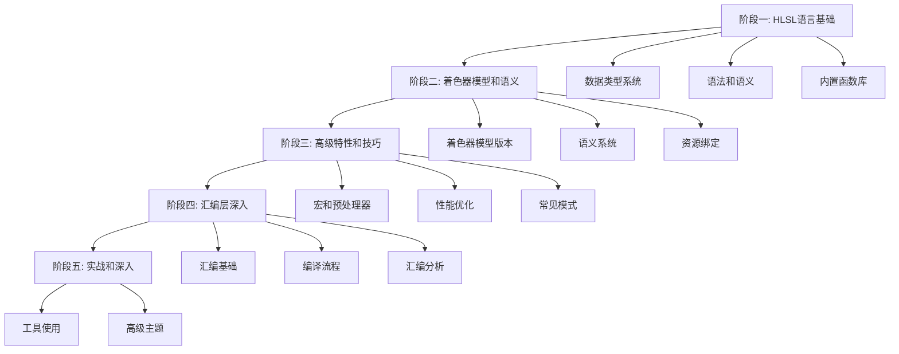

# HLSL 深度学习计划

#HLSL #学习计划 #着色器编程

> 从 HLSL 语言基础到汇编层深入的系统学习计划

## 📚 学习目标

- 掌握 HLSL 语言规范和语法
- 理解着色器模型和平台差异
- 能够阅读和分析 HLSL 汇编代码
- 掌握着色器优化技巧

---

## 🗺️ 学习路线图

---

## 📖 文档索引

### 阶段一：HLSL 语言基础（2-3周）
- [[HLSL_Data_Types|数据类型系统]]
- [[HLSL_Syntax_and_Semantics|语法和语义]]
- [[HLSL_Builtin_Functions|内置函数库]]

### 阶段二：着色器模型和语义（2-3周）
- [[Shader_Model_Versions|着色器模型版本]]
- [[HLSL_Semantics|语义系统]]
- [[Resource_Binding|资源绑定]]

### 阶段三：高级特性和技巧（2-3周）
- [[Macros_and_Preprocessor|宏和预处理器]]
- [[Performance_Optimization|性能优化技巧]]
- [[Common_Patterns_and_Algorithms|常见模式和算法]]

### 阶段四：汇编层深入（3-4周）
- [[Assembly_Basics|汇编基础]]
- [[Compilation_Pipeline|编译流程分析]]
- [[Assembly_Code_Analysis|汇编代码分析]]
- [[Platform_Differences|平台差异]]

### 阶段五：实战和深入（持续）
- [[Tools_Guide|工具使用指南]]
- [[Advanced_Topics|高级主题]]

---

## ✅ 学习进度跟踪

### 阶段一：HLSL 语言基础
- [ ] [[HLSL_Data_Types|数据类型系统]] - 基础类型、向量、矩阵、数组和结构体
- [ ] [[HLSL_Syntax_and_Semantics|语法和语义]] - 变量、函数、控制流
- [ ] [[HLSL_Builtin_Functions|内置函数库]] - 数学函数、向量运算、纹理采样

### 阶段二：着色器模型和语义
- [ ] [[Shader_Model_Versions|着色器模型版本]] - SM 2.0/3.0/4.0/5.0/6.0+
- [ ] [[HLSL_Semantics|语义系统]] - 顶点/像素/几何/计算着色器语义
- [ ] [[Resource_Binding|资源绑定]] - 纹理、采样器、常量缓冲区

### 阶段三：高级特性和技巧
- [ ] [[Macros_and_Preprocessor|宏和预处理器]] - 条件编译、函数式宏
- [ ] [[Performance_Optimization|性能优化技巧]] - 精度、指令、纹理、分支优化
- [ ] [[Common_Patterns_and_Algorithms|常见模式和算法]] - 光照、颜色空间、噪声、后处理

### 阶段四：汇编层深入
- [ ] [[Assembly_Basics|汇编基础]] - 寄存器、指令格式、常用指令
- [ ] [[Compilation_Pipeline|编译流程分析]] - HLSL→汇编流程、编译器优化
- [ ] [[Assembly_Code_Analysis|汇编代码分析]] - 阅读技巧、性能分析
- [ ] [[Platform_Differences|平台差异]] - DirectX vs OpenGL、不同 GPU 架构

### 阶段五：实战和深入
- [ ] [[Tools_Guide|工具使用指南]] - FXC/DXC、RenderDoc、GPU ShaderAnalyzer
- [ ] [[Advanced_Topics|高级主题]] - 计算着色器、光线追踪、Wave 操作

---

## 📚 学习资源

### 官方文档
- [Microsoft HLSL 文档](https://learn.microsoft.com/en-us/windows/win32/direct3dhlsl/dx-graphics-hlsl)
- HLSL 语言规范（PDF）
- Shader Model 规范文档

### 工具下载
- [DirectX Shader Compiler](https://github.com/microsoft/DirectXShaderCompiler)
- [RenderDoc](https://renderdoc.org/)
- AMD GPU ShaderAnalyzer
- NVIDIA Nsight Graphics

### 参考书籍
- 《Real-Time Rendering》（第4版）- 渲染理论
- 《GPU Gems》系列 - 实战技巧
- 《Programming Vertex, Geometry, and Pixel Shaders》- 着色器编程

### 在线资源
- [ShaderToy](https://www.shadertoy.com/) - 在线着色器编写和分享
- HLSL 相关技术博客和教程

---

## 💡 学习建议

1. **理论与实践结合**：每学一个概念，立即编写代码验证
2. **对比学习**：对比不同写法生成的汇编，理解优化
3. **工具驱动**：使用编译器工具查看实际输出，不要仅凭想象
4. **循序渐进**：先掌握基础，再深入汇编层
5. **持续实践**：定期编写和优化着色器，保持手感

---

## 🎯 评估标准

### 基础阶段完成标准
- [ ] 能够熟练使用所有 HLSL 基础类型和语法
- [ ] 理解着色器模型差异和语义系统
- [ ] 能够编写完整的顶点/像素着色器对

### 高级阶段完成标准
- [ ] 能够使用宏系统组织复杂代码
- [ ] 掌握常见优化技巧
- [ ] 能够实现复杂的光照和效果算法

### 汇编阶段完成标准
- [ ] 能够阅读和理解 HLSL 汇编代码
- [ ] 能够分析汇编代码的性能特征
- [ ] 能够根据汇编输出优化 HLSL 代码

### 精通标准
- [ ] 能够编写高性能的生产级着色器
- [ ] 能够深入分析复杂着色器的汇编输出
- [ ] 能够针对不同平台进行优化

---

## 🔗 相关链接

- [[HLSL_Data_Types]]
- [[HLSL_Syntax_and_Semantics]]
- [[HLSL_Builtin_Functions]]
- [[Shader_Model_Versions]]
- [[HLSL_Semantics]]
- [[Resource_Binding]]
- [[Macros_and_Preprocessor]]
- [[Performance_Optimization]]
- [[Common_Patterns_and_Algorithms]]
- [[Assembly_Basics]]
- [[Compilation_Pipeline]]
- [[Assembly_Code_Analysis]]
- [[Platform_Differences]]
- [[Tools_Guide]]
- [[Advanced_Topics]]

---

*最后更新：2024年*

