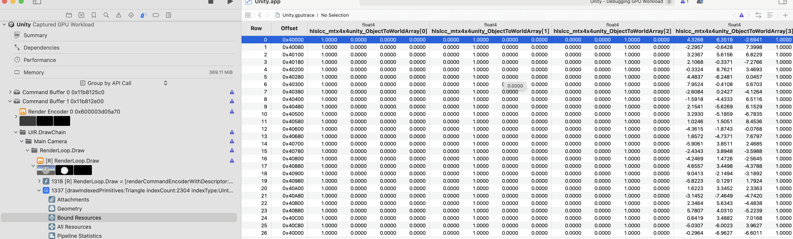
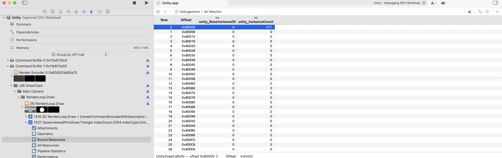
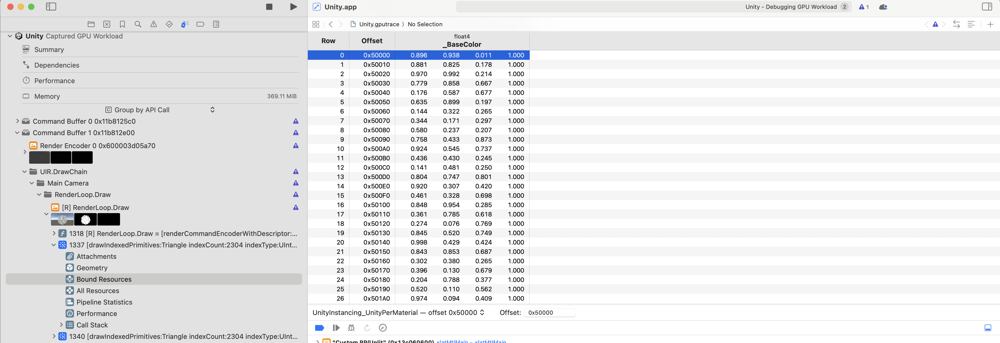

# [[UnityInstancing]] - Unity GPU 实例化

## 概述

- **文件路径**：`Packages/com.unity.render-pipelines.core/ShaderLibrary/UnityInstancing.hlsl`
- **主要职责**：提供 Unity GPU 实例化的宏和函数，支持传统实例化、程序化实例化和 DOTS 实例化
- **使用场景**：所有需要 GPU 实例化的着色器

## 依赖关系

- **依赖的文件**：[[Common]] - 基础类型和宏定义
- **被依赖的文件**：使用实例化的着色器

---

## GPU Instancing 工作原理深入分析

### 核心概念

GPU Instancing 允许使用**单个 DrawCall** 渲染多个相同网格的实例，每个实例可以有不同的 Transform 和 Per-Instance 属性（如颜色、缩放等）。

**关键优势：**
- ✅ 大幅减少 DrawCall（1000个物体 → 1个DrawCall）
- ✅ CPU开销极低（一次调用）
- ✅ GPU并行处理（SIMD执行）

### 完整工作流程

```
CPU端准备阶段：
┌─────────────────────────────────────────────┐
│ 1. 收集所有要实例化的物体                    │
│    ├─ Mesh: 必须相同                        │
│    ├─ Material: 必须相同                    │
│    └─ Transform: 可以不同（每个实例）        │
│                                              │
│ 2. 准备实例数据数组                          │
│    ├─ Transform矩阵数组                      │
│    ├─ Per-Instance属性数组（如_BaseColor）  │
│    └─ 实例数量受Constant Buffer大小限制      │
│        └─ 如果超过限制，自动分割成多个批次    │
│                                              │
│ 3. 上传到GPU Buffer                         │
│    ├─ UnityInstancing_PerDraw0 (Transform)   │
│    ├─ UnityInstancing_UnityPerMaterial       │
│    └─ UnityDrawCallInfo (批次信息)          │
└─────────────────────────────────────────────┘
         ↓
GPU端渲染阶段（一次DrawInstanced调用）：
┌─────────────────────────────────────────────┐
│ 1. GPU硬件自动为每个实例调用顶点着色器        │
│    ├─ Instance 0: mtl_InstanceID = 0        │
│    ├─ Instance 1: mtl_InstanceID = 1        │
│    ├─ Instance 2: mtl_InstanceID = 2        │
│    └─ ... (并行执行)                         │
│                                              │
│ 2. 顶点着色器处理（每个实例独立执行）          │
│    ├─ 读取 mtl_InstanceID（GPU自动提供）    │
│    ├─ 计算数组索引                           │
│    ├─ 访问 Transform: unity_Builtins0Array[index]│
│    ├─ 变换顶点位置                           │
│    └─ 传递 instanceID 到片元着色器          │
│                                              │
│ 3. 片元着色器处理                            │
│    ├─ 从varying中获取 instanceID            │
│    ├─ 访问材质属性: UnityPerMaterialArray[index]│
│    └─ 输出最终颜色                           │
│                                              │
│ 4. 结果：一次DrawCall渲染所有实例            │
└─────────────────────────────────────────────┘
```

---

## 源代码到编译代码的转换

### 源代码（UnlitPass.hlsl）

```hlsl
// 1. 定义实例化属性缓冲区
UNITY_INSTANCING_BUFFER_START(UnityPerMaterial)
    UNITY_DEFINE_INSTANCED_PROP(float4, _BaseColor)
UNITY_INSTANCING_BUFFER_END(UnityPerMaterial)

// 2. 顶点输入结构
struct Attributes {
    float3 positionOS : POSITION;
    UNITY_VERTEX_INPUT_INSTANCE_ID  // 展开为: uint instanceID : SV_InstanceID;
};

// 3. 顶点着色器
Varyings UnlitPassVertex(Attributes input) {
    Varyings output;
    UNITY_SETUP_INSTANCE_ID(input);        // 设置 unity_InstanceID
    UNITY_TRANSFER_INSTANCE_ID(input, output);
    float3 positionWS = TransformObjectToWorld(input.positionOS);
    output.positionCS = TransformWorldToHClip(positionWS);
    return output;
}

// 4. 片元着色器
float4 UnlitPassFragment(Varyings input) : SV_TARGET {
    UNITY_SETUP_INSTANCE_ID(input);
    return UNITY_ACCESS_INSTANCED_PROP(UnityPerMaterial, _BaseColor);
}
```

### 预处理后的代码（宏展开后）

> **注意**：以下代码是Unity Shader编译器预处理后的实际代码，展示了宏展开后的真实结构。这是**预处理后的源码**，而非反编译结果。

**完整的预处理后代码（Metal平台）：**

```hlsl
// ===== 标准Per-Draw数据（非Instancing时使用） =====
cbuffer UnityPerDraw {
    float4x4 unity_ObjectToWorld;
    float4x4 unity_WorldToObject;
    float4 unity_LODFade;
    float4 unity_WorldTransformParams;
};

float4x4 unity_MatrixVP;
float4x4 unity_MatrixV;
float4x4 unity_MatrixInvV;
float4x4 unity_prev_MatrixM;
float4x4 unity_prev_MatrixIM;
float4x4 glstate_matrix_projection;

// ===== GPU Instancing相关定义 =====
// File: UnityInstancing.hlsl

static uint unity_InstanceID;  // 当前实例ID（全局变量）

// 批次信息
cbuffer UnityDrawCallInfo {
    int unity_BaseInstanceID;
    int unity_InstanceCount;
}

// 设置实例ID的辅助函数
void UnitySetupInstanceID(uint inputInstanceID)
{
    const int localBaseInstanceId = unity_BaseInstanceID;
    unity_InstanceID = inputInstanceID + localBaseInstanceId;
}

// Per-Instance Transform数据（每个实例128字节）
cbuffer UnityInstancing_PerDraw0 {
    struct {
        float4x4 unity_ObjectToWorldArray;
        float4x4 unity_WorldToObjectArray;
    } unity_Builtins0Array[2];  // ← 编译时大小，实际运行时动态扩展
}

// Per-Instance Renderer Bounds
cbuffer UnityInstancing_PerDraw1 {
    struct {
        float4 unity_RendererBounds_MinArray;
        float4 unity_RendererBounds_MaxArray;
    } unity_Builtins1Array[2];
}

// Per-Instance Spherical Harmonics（光照探针）
cbuffer UnityInstancing_PerDraw2 {
    struct {
        half4 unity_SHArArray;
        half4 unity_SHAgArray;
        half4 unity_SHAbArray;
        half4 unity_SHBrArray;
        half4 unity_SHBgArray;
        half4 unity_SHBbArray;
        half4 unity_SHCArray;
    } unity_Builtins2Array[2];
}

// Per-Instance Previous Frame Transform（Motion Vectors）
cbuffer UnityInstancing_PerDraw3 {
    struct {
        float4x4 unity_PrevObjectToWorldArray;
        float4x4 unity_PrevWorldToObjectArray;
    } unity_Builtins3Array[2];
}

// Per-Instance 材质属性
cbuffer UnityInstancing_UnityPerMaterial {
    struct {
        float4 _BaseColor;
    } UnityPerMaterialArray[2];  // ← 编译时大小，实际运行时动态扩展
}

// ===== 着色器输入/输出结构 =====
struct Attributes {
    float3 positionOS : POSITION;
    uint instanceID : SV_InstanceID;  // ← GPU自动提供（Metal: [[instance_id]]）
};

struct Varyings {
    float4 positionCS : POSITION;
    uint instanceID : SV_InstanceID;  // ← 传递到片元着色器
};

// ===== 顶点着色器 =====
Varyings UnlitPassVertex(Attributes input)
{
    Varyings output;
    
    // 1. 设置全局unity_InstanceID
    UnitySetupInstanceID(input.instanceID);
    // 展开后：unity_InstanceID = input.instanceID + unity_BaseInstanceID;
    
    // 2. 传递实例ID到片元着色器（注意：传递的是原始instanceID，不是unity_InstanceID）
    output.instanceID = input.instanceID;
    
    // 3. TransformObjectToWorld内部会使用unity_Builtins0Array[unity_InstanceID]
    float3 positionWS = TransformObjectToWorld(input.positionOS);
    // 内部实现（简化）：
    //   float4x4 objectToWorld = unity_Builtins0Array[unity_InstanceID].unity_ObjectToWorldArray;
    //   positionWS = mul(objectToWorld, float4(input.positionOS, 1.0)).xyz;
    
    output.positionCS = TransformWorldToHClip(positionWS);
    return output;
}

// ===== 片元着色器 =====
float4 UnlitPassFragment(Varyings input) : SV_TARGET
{
    // 1. 从varying中恢复unity_InstanceID
    UnitySetupInstanceID(input.instanceID);
    // 展开后：unity_InstanceID = input.instanceID + unity_BaseInstanceID;
    
    // 2. 访问当前实例的材质属性
    return UnityPerMaterialArray[unity_InstanceID]._BaseColor;
}
```

**关键点解析：**

1. **数组大小 `[2]` 的含义**：
   - 这是编译时的最小大小，满足编译器要求
   - 实际运行时，Unity会根据实例数量动态分配更大的Buffer
   - Metal等现代API支持动态数组大小（`UNITY_INSTANCING_SUPPORT_FLEXIBLE_ARRAY_SIZE`）
   - 编译时使用`[2]`是为了兼容性，运行时可以访问更大的数组

2. **`unity_InstanceID` 的计算**：
   ```hlsl
   // 顶点着色器中
   UnitySetupInstanceID(input.instanceID);
   // 实际计算：unity_InstanceID = input.instanceID + unity_BaseInstanceID;
   // 其中：
   //   - input.instanceID: GPU自动提供的实例ID（0, 1, 2, ...）
   //   - unity_BaseInstanceID: 批次偏移（用于多批次合并）
   
   // 片元着色器中
   UnitySetupInstanceID(input.instanceID);
   // 从varying中恢复：unity_InstanceID = input.instanceID + unity_BaseInstanceID;
   ```

3. **数组访问模式**：
   ```hlsl
   // 访问Transform（在TransformObjectToWorld内部）
   unity_Builtins0Array[unity_InstanceID].unity_ObjectToWorldArray
   
   // 访问材质属性
   UnityPerMaterialArray[unity_InstanceID]._BaseColor
   ```

4. **多个PerDraw Buffer的原因**：
   - `UnityInstancing_PerDraw0`: Transform矩阵（最常用）
   - `UnityInstancing_PerDraw1`: Renderer Bounds（用于视锥剔除）
   - `UnityInstancing_PerDraw2`: Spherical Harmonics（光照探针数据）
   - `UnityInstancing_PerDraw3`: Previous Frame Transform（Motion Vectors）
   - 分离存储可以提高缓存效率，只加载需要的Buffer

---

## 驱动层实现机制（基于Metal调试截图）

> **重要发现**：通过 Metal GPU Frame Debugger 的实际调试发现，GPU Instancing 在驱动层的实现机制与理论模型有重要差异。以下内容基于实际驱动层指令分析（参考 `../extension/instancing_*.png`）。


*图1：Metal平台下GPU Instancing的Bound Resources。可以看到所有数据都通过Buffer绑定，而不是Vertex Attribute。*

### Buffer绑定机制

**Metal平台的实际实现：**

```
顶点着色器绑定：
├─ Buffer 0: VGlobals (VP矩阵，所有实例共享)
├─ Buffer 1: UnityDrawCallInfo (批次信息)
└─ Buffer 2: UnityInstancing_PerDraw0 (Transform数组，指针)

片元着色器绑定：
├─ Buffer 0: UnityDrawCallInfo (批次信息)
└─ Buffer 1: UnityInstancing_UnityPerMaterial (材质属性数组，指针)
```

**关键发现：**

1. **使用Buffer绑定**
   - 所有per-instance数据通过Constant Buffer传递
   - 使用`[[ buffer(X) ]]`绑定点

2. **指针数组而非固定大小数组**
   ```metal
   // Metal使用指针
   const constant unity_Builtins0Array_Type* UnityInstancing_PerDraw0 [[ buffer(2) ]]
   ```

3. **统一的内存管理**
   - 所有Buffer可能指向同一个物理Buffer（ScratchBuffer0_2）
   - 通过不同的offset访问不同区域
   - 减少内存碎片，提高缓存效率

### 内存布局（基于调试截图）



*图2：UnityInstancing_PerDraw0的实际内存布局。每个实例间隔128字节（0x80），包含ObjectToWorld和WorldToObject矩阵。*

**UnityInstancing_PerDraw0 Buffer布局：**

```
内存地址布局：
┌─────────────────────────────────────────────┐
│ Offset: 0x40000                             │
│ Instance 0:                                  │
│   ├─ unity_ObjectToWorldArray[0-3] (64字节)│
│   └─ unity_WorldToObjectArray[0-3] (64字节) │
│                                              │
│ Offset: 0x40080 (0x40000 + 0x80)            │
│ Instance 1:                                  │
│   ├─ unity_ObjectToWorldArray[0-3]          │
│   └─ unity_WorldToObjectArray[0-3]          │
│                                              │
│ Offset: 0x40100 (0x40000 + 0x100)           │
│ Instance 2:                                  │
│   └─ ...                                     │
│                                              │
│ 每个实例: 128字节 (0x80)                     │
│ 包含: 2个4x4矩阵 = 8个float4 = 128字节      │
└─────────────────────────────────────────────┘
```

**UnityInstancing_UnityPerMaterial Buffer布局：**



*图3：UnityInstancing_UnityPerMaterial的实际内存布局。每个实例间隔16字节（0x10），包含一个float4（_BaseColor）。*

```
内存地址布局：
┌─────────────────────────────────────────────┐
│ Offset: 0x50000                             │
│ Instance 0: _BaseColor (16字节)            │
│   └─ (0.896, 0.938, 0.011, 1.000)           │
│                                              │
│ Offset: 0x50010 (0x50000 + 0x10)            │
│ Instance 1: _BaseColor (16字节)            │
│   └─ (0.881, 0.825, 0.178, 1.000)           │
│                                              │
│ Offset: 0x50020 (0x50000 + 0x20)           │
│ Instance 2: _BaseColor (16字节)            │
│   └─ ...                                    │
│                                              │
│ 每个实例: 16字节 (0x10)                      │
│ 包含: 1个float4 = 16字节                    │
└─────────────────────────────────────────────┘
```

**UnityDrawCallInfo Buffer布局：**



*图4：UnityDrawCallInfo的实际内存布局。显示批次信息：unity_BaseInstanceID=0, unity_InstanceCount=511。*

```
内存地址布局：
┌─────────────────────────────────────────────┐
│ Offset: 0x80000                             │
│ unity_BaseInstanceID: 0                     │
│ unity_InstanceCount: 511                    │
│                                              │
│ 说明：                                       │
│ - 这个批次从实例0开始                        │
│ - 总共绘制511个实例（实际数量取决于Buffer大小限制）│
│ - 如果超过限制，Unity会自动分割成多个批次     │
└─────────────────────────────────────────────┘
```

### 索引计算机制

**顶点着色器中的索引计算（Metal）：**

```hlsl
// 预处理后的代码
void UnitySetupInstanceID(uint inputInstanceID)
{
    const int localBaseInstanceId = unity_BaseInstanceID;
    unity_InstanceID = inputInstanceID + localBaseInstanceId;
}

// 实际使用
Varyings UnlitPassVertex(Attributes input)
{
    // 1. GPU自动提供的实例ID（[[instance_id]]）
    //    input.instanceID = 0, 1, 2, ..., (批次实例数-1)
    
    // 2. 设置全局unity_InstanceID
    UnitySetupInstanceID(input.instanceID);
    //    unity_InstanceID = input.instanceID + unity_BaseInstanceID;
    //    如果这是第一个批次，unity_BaseInstanceID = 0
    //    如果这是第二个批次，unity_BaseInstanceID = 前一批次的实例数量
    
    // 3. 访问数组（驱动层会优化）
    float3 positionWS = TransformObjectToWorld(input.positionOS);
    //    内部：unity_Builtins0Array[unity_InstanceID].unity_ObjectToWorldArray
}
```

**驱动层的实际处理（基于Metal反汇编）：**

```metal
// 驱动层可能进行的优化
// 1. GPU自动提供的实例ID
uint mtl_InstanceID [[ instance_id ]];  // 0, 1, 2, ..., 510

// 2. 处理间接绘制（如果有）
mtl_InstanceID = mtl_InstanceID - mtl_BaseInstance;

// 3. 加上批次偏移
int index = int(mtl_InstanceID) + UnityDrawCallInfo.unity_BaseInstanceID;

// 4. 计算Transform数组的偏移（每个实例8个float4 = 128字节）
index = index << 3;  // 乘以8（位运算优化）

// 5. 访问Transform矩阵
UnityInstancing_PerDraw0[index / 8].unity_ObjectToWorldArray[...]
```

**为什么需要 `index << 3`（乘以8）？**

```
每个实例的数据结构：
┌─────────────────────────────────────────────┐
│ unity_Builtins0Array_Type {                 │
│     float4x4 unity_ObjectToWorldArray[4];   │  ← 4个float4
│     float4x4 unity_WorldToObjectArray[4];   │  ← 4个float4
│ }                                            │
│                                              │
│ 总计: 8个float4 = 32个float = 128字节      │
└─────────────────────────────────────────────┘

数组索引计算：
├─ Instance 0: index = 0, 访问数组[0]
├─ Instance 1: index = 8, 访问数组[1]  ← 需要除以8
├─ Instance 2: index = 16, 访问数组[2]
└─ ...

所以：数组索引 = (instanceID << 3) / 8 = instanceID
```

### 实例ID的传递机制

**顶点着色器 → 片元着色器：**

```metal
// 顶点着色器输出
struct Mtl_VertexOut {
    float4 mtl_Position [[ position ]];
    uint SV_InstanceID0 [[ user(SV_InstanceID0) ]];  // 传递实例ID
};

// 片元着色器输入
struct Mtl_FragmentIn {
    uint SV_InstanceID0 [[ user(SV_InstanceID0) ]] [[ flat ]];  // ← flat关键字！
};
```

**为什么使用 `[[ flat ]]`？**

`flat` 关键字表示该变量**不会被插值**，所有片元使用图元第一个顶点的值：

```
一个三角形图元（3个顶点）：
├─ 顶点0: SV_InstanceID0 = 5
├─ 顶点1: SV_InstanceID0 = 5  ← 相同实例
└─ 顶点2: SV_InstanceID0 = 5  ← 相同实例

光栅化后生成的片元：
├─ 片元A: SV_InstanceID0 = 5  ← 使用顶点0的值（flat）
├─ 片元B: SV_InstanceID0 = 5  ← 使用顶点0的值（flat）
└─ 片元C: SV_InstanceID0 = 5  ← 使用顶点0的值（flat）

原因：
- 实例ID是整数，不能插值
- 一个图元的所有片元必须属于同一个实例
- flat确保所有片元使用相同的实例ID
```

---

## 宏定义详解

### UNITY_INSTANCING_BUFFER_START / END

**宏定义（UnityInstancing.hlsl）：**
```hlsl
#define UNITY_INSTANCING_BUFFER_START(buf) \
    UNITY_INSTANCING_CBUFFER_SCOPE_BEGIN(UnityInstancing_##buf) struct {
    
#define UNITY_INSTANCING_BUFFER_END(arr) \
    } arr##Array[UNITY_INSTANCED_ARRAY_SIZE]; \
    UNITY_INSTANCING_CBUFFER_SCOPE_END
```

**展开示例：**
```hlsl
// 源代码
UNITY_INSTANCING_BUFFER_START(UnityPerMaterial)
    UNITY_DEFINE_INSTANCED_PROP(float4, _BaseColor)
UNITY_INSTANCING_BUFFER_END(UnityPerMaterial)

// 展开后（Metal平台）
cbuffer UnityInstancing_UnityPerMaterial {
    struct {
        float4 _BaseColor;
    } UnityPerMaterialArray[2];  // ← 编译时大小（实际运行时可能更大）
}
```

**关键点：**
- `UNITY_INSTANCED_ARRAY_SIZE` 在Metal平台默认为2（编译时最小要求）
- 实际运行时，Unity会根据实例数量动态分配更大的Buffer
- 编译时的2只是为了让代码能够编译通过

### UNITY_DEFINE_INSTANCED_PROP

**宏定义：**
```hlsl
#define UNITY_DEFINE_INSTANCED_PROP(type, var) type var;
```

**作用：**
- 在结构体中定义per-instance属性
- 每个实例有独立的值

**展开示例：**
```hlsl
// 源代码
UNITY_DEFINE_INSTANCED_PROP(float4, _BaseColor)

// 展开后
struct {
    float4 _BaseColor;  // ← 每个实例独立
} UnityPerMaterialArray[2];
```

### UNITY_ACCESS_INSTANCED_PROP

**宏定义：**
```hlsl
#define UNITY_ACCESS_INSTANCED_PROP(arr, var) \
    arr##Array[unity_InstanceID].var
```

**作用：**
- 访问当前实例的属性
- 使用全局变量 `unity_InstanceID` 作为数组索引

**展开示例：**
```hlsl
// 源代码
UNITY_ACCESS_INSTANCED_PROP(UnityPerMaterial, _BaseColor)

// 展开后
UnityPerMaterialArray[unity_InstanceID]._BaseColor
```

### UNITY_SETUP_INSTANCE_ID

**宏定义：**
```hlsl
#define UNITY_SETUP_INSTANCE_ID(input) \
    { UnitySetupInstanceID(UNITY_GET_INSTANCE_ID(input)); }
```

**UnitySetupInstanceID函数：**
```hlsl
void UnitySetupInstanceID(uint inputInstanceID)
{
    const int localBaseInstanceId = unity_BaseInstanceID;
    unity_InstanceID = inputInstanceID + localBaseInstanceId;
}
```

**作用：**
- 设置全局变量 `unity_InstanceID`
- 处理批次偏移（`unity_BaseInstanceID`）
- 必须在访问per-instance属性之前调用

---

## Constant Buffer结构详解

### UnityDrawCallInfo

```hlsl
cbuffer UnityDrawCallInfo {
    int unity_BaseInstanceID;  // 批次起始实例ID
    int unity_InstanceCount;    // 批次实例数量
}
```

**用途：**
- 支持多批次渲染（当实例数超过限制时）
- `unity_BaseInstanceID`：当前批次在全局实例数组中的起始索引
- `unity_InstanceCount`：当前批次包含的实例数量

**示例：**
```
场景：1000个实例，假设每个实例144字节，限制为454个/批次

批次1：
├─ unity_BaseInstanceID = 0
├─ unity_InstanceCount = 454
└─ 渲染实例 0-453

批次2：
├─ unity_BaseInstanceID = 454
├─ unity_InstanceCount = 454
└─ 渲染实例 454-907

批次3：
├─ unity_BaseInstanceID = 908
├─ unity_InstanceCount = 92
└─ 渲染实例 908-999
```

### UnityInstancing_PerDraw0

```hlsl
cbuffer UnityInstancing_PerDraw0 {
    struct {
        float4x4 unity_ObjectToWorldArray;
        float4x4 unity_WorldToObjectArray;
    } unity_Builtins0Array[UNITY_INSTANCED_ARRAY_SIZE];
}
```

**内容：**
- 每个实例的Transform矩阵
- `unity_ObjectToWorldArray`：对象空间到世界空间的变换
- `unity_WorldToObjectArray`：世界空间到对象空间的逆变换

**内存大小：**
- 每个实例：128字节（2个4x4矩阵）
- 固定大小，不随Shader变化

### UnityInstancing_UnityPerMaterial

```hlsl
cbuffer UnityInstancing_UnityPerMaterial {
    struct {
        float4 _BaseColor;
        // ... 其他per-instance材质属性
    } UnityPerMaterialArray[UNITY_INSTANCED_ARRAY_SIZE];
}
```

**内容：**
- 每个实例的材质属性
- 由Shader中 `UNITY_DEFINE_INSTANCED_PROP` 定义

**内存大小：**
- 取决于Shader中定义的per-instance属性数量和类型
- 示例1：只有`_BaseColor`（float4）时，每个实例16字节
- 示例2：`_BaseColor`（float4）+ `_Scale`（float）时，每个实例32字节（std140对齐）
- **关键**：每个实例的数据大小直接影响能容纳的实例数量

---

## 实例化类型

### 传统实例化 (`INSTANCING_ON`)

- **定义**：Unity 的传统 GPU 实例化
- **支持平台**：D3D11、GLES3、GLCore、Metal、Vulkan、Switch 等
- **实现方式**：使用常量缓冲区存储实例数据
- **特点**：
  - 使用 `[[ instance_id ]]` 获取实例ID
  - 通过Buffer绑定传递per-instance数据
  - 实例数量受Constant Buffer大小限制（通常64KB）

### 程序化实例化 (`PROCEDURAL_INSTANCING_ON`)

- **定义**：计算着色器驱动的实例化
- **实现方式**：通过计算着色器生成实例数据
- **特点**：
  - 适合大量实例（数千个）
  - 可以在GPU上生成实例数据
  - 支持更复杂的实例化逻辑

### DOTS 实例化 (`DOTS_INSTANCING_ON`)

- **定义**：Unity DOTS（Data-Oriented Technology Stack）实例化
- **实现方式**：使用 `ByteAddressBuffer` 或 `cbuffer` 存储实例数据
- **依赖**：[[UnityDOTSInstancing]] - DOTS 实例化实现
- **特点**：
  - 与ECS系统集成
  - 支持超大量实例
  - 数据布局更灵活

### 立体渲染实例化 (`STEREO_INSTANCING_ON`)

- **定义**：VR 立体渲染的实例化
- **支持平台**：D3D11、GLCore、GLES3、Vulkan
- **特点**：
  - 同时渲染左右眼
  - 使用实例ID的低位表示眼睛索引

---

## 性能优化要点

### 顶点数要求

> **官方建议**：不要对顶点数少于256的Mesh使用GPU Instancing

**原因：GPU Warp利用率**

```
GPU并行架构（以NVIDIA为例）：
├─ 1个Warp = 32个线程
├─ Warp是最小调度单位
└─ 所有线程必须执行相同指令（SIMD）

低顶点数问题：
├─ 24顶点Cube: 需要1个Warp，但只用24个线程
├─ 浪费: 8个线程空闲（25%浪费）
└─ GPU利用率: ~75%

高顶点数优势：
├─ 256顶点: 需要8个Warp，所有线程都在工作
├─ 浪费: 0个线程空闲
└─ GPU利用率: ~100%
```

**数学分析：**
```
Warp利用率 = 实际使用的线程数 / Warp大小

24顶点: 24/32 = 75%  ⚠️
100顶点: 100/128 = 78%  ⚠️
256顶点: 256/256 = 100%  ✅
512顶点: 512/512 = 100%  ✅
```

### 实例数量限制

> **重要**：实例数量限制**不是固定值**，而是取决于**Constant Buffer大小限制**和**每个实例的数据大小**。

**限制计算公式：**

```
最大实例数 = Constant Buffer大小限制 / 每个实例的数据大小

每个实例的数据大小包括：
├─ UnityInstancing_PerDraw0: 128字节（固定，Transform矩阵）
└─ UnityInstancing_UnityPerMaterial: 可变（取决于Shader中的per-instance属性）
```

**Constant Buffer大小限制（平台相关）：**
- **Metal/iOS**: 通常64KB（65,536字节）
- **Vulkan/Android**: 通常64KB
- **D3D11/PC**: 通常64KB

**实际限制示例：**

```
示例1：只有_BaseColor（float4）
├─ PerDraw0: 128字节/实例
├─ PerMaterial: 16字节/实例
├─ 总计: 144字节/实例
└─ 最大实例数: 65,536 / 144 ≈ 454个实例

示例2：_BaseColor（float4）+ _Scale（float）
├─ PerDraw0: 128字节/实例
├─ PerMaterial: 32字节/实例（std140对齐）
├─ 总计: 160字节/实例
└─ 最大实例数: 65,536 / 160 ≈ 409个实例

示例3：大量per-instance属性
├─ PerDraw0: 128字节/实例
├─ PerMaterial: 256字节/实例（假设）
├─ 总计: 384字节/实例
└─ 最大实例数: 65,536 / 384 ≈ 170个实例
```

**关键发现：**
- ✅ **材质uniform越大，能容纳的实例数量越少**
- ✅ Unity会自动计算实际限制，并在超过时分割成多个批次
- ✅ 每个批次仍然是1个DrawCall，性能仍然很好

**超过限制的处理：**
- Unity自动分割成多个批次
- 每个批次独立DrawCall
- 仍然比不使用Instancing高效

### 内存对齐

**std140对齐规则（Metal使用类似规则）：**
```
float4: 16字节对齐
float4x4: 16字节对齐
结构体: 按最大成员对齐
```

**实际内存布局：**
```
UnityInstancing_PerDraw0:
├─ 每个实例: 128字节（对齐到16字节）
├─ 包含: ObjectToWorld[4] + WorldToObject[4]
└─ 对齐: 16字节对齐

UnityInstancing_UnityPerMaterial:
├─ 每个实例: 16字节（float4对齐）
└─ 对齐: 16字节对齐
```

---

## 与SRP Batcher的对比

| 特性 | GPU Instancing | SRP Batcher |
|------|---------------|-------------|
| **数据存储** | 数组（每个实例一个元素） | 独立Buffer（每个Material一个） |
| **Transform** | 数组：`unity_Builtins0Array[index]` | 独立Buffer：`UnityPerDraw` |
| **材质属性** | 数组：`UnityPerMaterialArray[index]` | 独立Buffer：`UnityPerMaterial` |
| **实例ID来源** | `[[ instance_id ]]`（GPU自动） | 不需要（Material区分） |
| **DrawCall数量** | 1个（所有实例） | N个（每个Material一个） |
| **Material实例** | 必须相同 | 可以不同 |
| **Mesh要求** | 必须相同 | 可以不同 |
| **顶点数要求** | ≥256（推荐） | 无要求 |
| **适用场景** | 大量相同物体 | 不同Material的物体 |

**兼容性：**
```
⚠️ GPU Instancing与SRP Batcher不兼容！
- 启用GPU Instancing会使GameObject不兼容SRP Batcher
- 需要根据实际性能测试选择最优方案
```

**选择建议：**
```
需要绘制大量相同的物体？
├─ Mesh + Material完全相同？
│   ├─ 顶点数 ≥ 256？
│   │   ├─ YES → 使用GPU Instancing ✅
│   │   └─ NO → 考虑手动合并Mesh或SRP Batcher
│   │
│   └─ 需要Per-Instance属性？
│       └─ YES → 使用GPU Instancing（如果顶点数≥256）
│
└─ 物体使用相同Shader但不同Material？
    └─ YES → 使用SRP Batcher ✅
```

---

## 实际应用示例

### C#端代码

```csharp
using UnityEngine;

public class MeshBall : MonoBehaviour
{
    static int baseColorId = Shader.PropertyToID("_BaseColor");
    
    [SerializeField] Mesh mesh = default;
    [SerializeField] Material material = default;
    
    Matrix4x4[] matrices = new Matrix4x4[1023];
    Vector4[] baseColors = new Vector4[1024];
    MaterialPropertyBlock block;
    
    void Awake()
    {
        // 准备实例的Transform和颜色（数量受Buffer大小限制）
        for (int i = 0; i < matrices.Length; i++)
        {
            matrices[i] = Matrix4x4.TRS(
                Random.insideUnitSphere * 10f, 
                Quaternion.identity, 
                Vector3.one
            );
            baseColors[i] = new Vector4(
                Random.value, 
                Random.value, 
                Random.value, 
                1f
            );
        }
    }
    
    void Update()
    {
        if (block == null)
        {
            block = new MaterialPropertyBlock();
            block.SetVectorArray(baseColorId, baseColors);
        }
        
        // 一次DrawCall渲染多个实例（Unity会自动处理批次分割）
        Graphics.DrawMeshInstanced(
            mesh, 
            0, 
            material, 
            matrices, 
            matrices.Length,  // 实例数量（Unity会根据Buffer大小自动分割）
            block  // Per-Instance属性
        );
    }
}
```

### Shader端代码

```hlsl
// UnlitPass.hlsl
UNITY_INSTANCING_BUFFER_START(UnityPerMaterial)
    UNITY_DEFINE_INSTANCED_PROP(float4, _BaseColor)
UNITY_INSTANCING_BUFFER_END(UnityPerMaterial)

struct Attributes {
    float3 positionOS : POSITION;
    UNITY_VERTEX_INPUT_INSTANCE_ID
};

struct Varyings {
    float4 positionCS : POSITION;
    UNITY_VERTEX_INPUT_INSTANCE_ID
};

Varyings UnlitPassVertex(Attributes input)
{
    Varyings output;
    UNITY_SETUP_INSTANCE_ID(input);
    UNITY_TRANSFER_INSTANCE_ID(input, output);
    
    // TransformObjectToWorld内部会使用unity_Builtins0Array[unity_InstanceID]
    float3 positionWS = TransformObjectToWorld(input.positionOS);
    output.positionCS = TransformWorldToHClip(positionWS);
    return output;
}

float4 UnlitPassFragment(Varyings input) : SV_TARGET
{
    UNITY_SETUP_INSTANCE_ID(input);
    // 访问当前实例的_BaseColor
    return UNITY_ACCESS_INSTANCED_PROP(UnityPerMaterial, _BaseColor);
}
```

---

## 调试和验证

### Frame Debugger验证

```
Window → Analysis → Frame Debugger

查看：
├─ Draw Mesh Instanced (N instances)  ← GPU Instancing工作
├─ 展开查看：
│   ├─ Shader: Custom RP/Unlit
│   ├─ Instance Count: 实际实例数量（取决于Buffer大小）
│   └─ Keywords: INSTANCING_ON
```

### Metal GPU Frame Debugger验证

```
Xcode → Debug → GPU Frame Capture

查看Bound Resources：
├─ Buffer 2: UnityInstancing_PerDraw0
│   └─ 查看内存布局，确认每个实例的数据
│
├─ Buffer 1: UnityInstancing_UnityPerMaterial
│   └─ 查看每个实例的_BaseColor值
│
└─ Buffer 1: UnityDrawCallInfo
    └─ 查看unity_BaseInstanceID和unity_InstanceCount
```

### 性能监控

```csharp
using Unity.Profiling;

public class InstancingProfiler : MonoBehaviour
{
    ProfilerRecorder drawCallsRecorder;
    ProfilerRecorder batchesRecorder;
    
    void OnEnable()
    {
        drawCallsRecorder = ProfilerRecorder.StartNew(
            ProfilerCategory.Render, "Draw Calls Count");
        batchesRecorder = ProfilerRecorder.StartNew(
            ProfilerCategory.Render, "Batches Count");
    }
    
    void OnGUI()
    {
        int drawCalls = (int)drawCallsRecorder.LastValue;
        int batches = (int)batchesRecorder.LastValue;
        
        GUILayout.Label($"DrawCall: {drawCalls}");
        GUILayout.Label($"Batches: {batches}");
        
        // GPU Instancing应该显示：
        // DrawCall: 1 (或很少)
        // Batches: 1 (或很少)
    }
}
```

---

## 常见问题

### Q: 为什么我的实例没有显示不同的颜色？

**A:** 检查以下几点：
1. Shader中是否正确使用了 `UNITY_ACCESS_INSTANCED_PROP`
2. C#代码中是否正确设置了MaterialPropertyBlock
3. Material是否启用了Instancing（`material.enableInstancing = true`）

### Q: 为什么实例数量有限制？限制是多少？

**A:** 实例数量限制取决于两个因素：

1. **Constant Buffer大小限制**：
   - Metal/Vulkan/D3D11等平台通常限制为64KB（65,536字节）
   - 这是硬件和驱动的限制

2. **每个实例的数据大小**：
   - `UnityInstancing_PerDraw0`: 固定128字节/实例（Transform矩阵）
   - `UnityInstancing_UnityPerMaterial`: 可变，取决于Shader中的per-instance属性
   - **材质uniform越大，能容纳的实例数量越少**

**计算公式：**
```
最大实例数 = 64KB / (128字节 + PerMaterial大小)
```

**示例：**
- 只有`_BaseColor`（16字节）: 65,536 / 144 ≈ 454个实例
- 有`_BaseColor` + `_Scale`（32字节）: 65,536 / 160 ≈ 409个实例
- 大量属性（256字节）: 65,536 / 384 ≈ 170个实例

**Unity会自动处理：**
- 超过限制时，Unity会自动分割成多个批次
- 每个批次仍然是1个DrawCall，性能仍然很好

### Q: GPU Instancing和SRP Batcher可以同时使用吗？

**A:** 不可以，它们是互斥的：
- 启用GPU Instancing的GameObject不兼容SRP Batcher
- 需要根据场景选择最优方案
- 通常：相同Mesh+Material → GPU Instancing，不同Material → SRP Batcher

### Q: 为什么低顶点数的Mesh不适合GPU Instancing？

**A:** GPU Warp利用率问题：
- GPU以Warp（32线程）为单位调度
- 低顶点数导致Warp中的线程浪费
- 建议：顶点数 ≥ 256，或使用手动合并Mesh

---

## 参考资料

- Unity GPU Instancing：https://docs.unity3d.com/Manual/GPUInstancing.html
- Unity SRP Batcher：https://docs.unity3d.com/Manual/SRPBatcher.html
- Metal Shading Language：https://developer.apple.com/metal/Metal-Shading-Language-Specification.pdf
