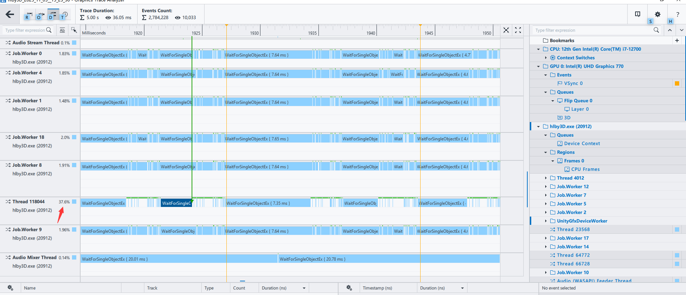
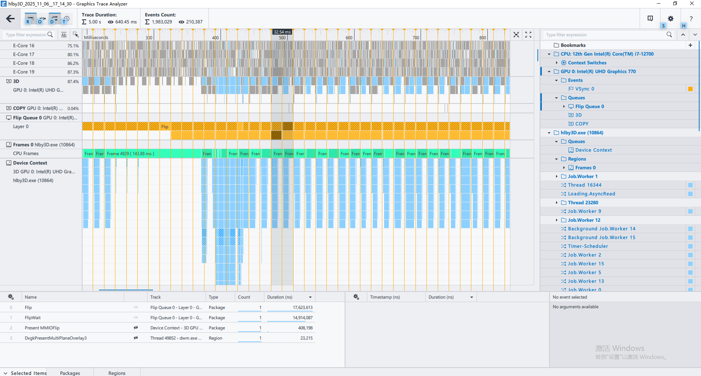

# GPA (Graphics Performance Analyzer) 使用笔记

## 1. 概述

Intel Graphics Performance Analyzer (GPA) 是用于分析图形应用性能的工具，支持 DirectX、Vulkan、OpenGL 等 API。

### 三种分析模式

- **Trace 模式**：记录完整的执行轨迹，可以看到时间线上的所有事件
- **Stream 模式**：实时监控性能指标（待补充）
- **Frame 模式**：单帧详细分析（待补充）

---

## 2. Trace 模式 - 核心概念

### 2.1 视图层次结构

Trace 模式中有三个主要的视图层次，从上到下依次是：

#### GPU Queue（GPU 命令队列）

显示 GPU 硬件的实际执行状态。

**上下两行的含义**：
- 代表 GPU 的多个硬件执行队列
- 现代 GPU 支持并行执行（如 Graphics Queue 和 Copy Queue）
- 两行可以部分重叠，提高 GPU 吞吐量
- 时间接近说明流水线效率高

**DMA Package**：
- DMA = Direct Memory Access（直接内存访问）
- DMA Package = GPU 命令缓冲区包
- 应用通过 DMA 将命令传递给 GPU
- 颜色对应提交该命令的线程

**关键指标**：
- 100% 利用率：GPU Bound（GPU 是瓶颈）
- 大量空白：CPU Bound（CPU 成为瓶颈）

#### Flip Queue（显示队列）

显示应用 Present 调用、GPU 队列和 VSync 事件之间的关系。

**双层结构**：

**上层（带网格纹理）**：
- FlipWait：等待上一个 Flip 完成
- Flip（网格纹理）：准备当前帧，等待提交
- 代表下一帧的准备阶段
- 时间不规律，反映实际工作负载

**下层（实心块）**：
- Flip（实心）：正在显示的帧
- 包含 DWM 处理 + VSync 等待
- 时间非常稳定（~16ms @ 60Hz）
- 代表帧的逻辑边界标记
- 这个是推测的结论!

**实心块 vs 网格块**：
- 实心：DWM 正在生成显示内容（CPU/GPU 处理中）
- 网格：内容已准备好，等待 VSync 显示时机

**时间关系**：
```
上层准备帧 N+1，同时下层显示帧 N
形成流水线，这就是三缓冲（Triple Buffering）的可视化
```

**关键理解**：
- 上层 = 实际工作节奏（真实的 Flip Queue）
- 下层 = 帧边界视图（抽象的帧周期标记）

#### Device Context（设备上下文）

显示应用程序提交的命令序列，最细粒度的 GPU 活动追踪。

**常见命令类型**：
- `Present`：呈现命令（提交帧）
- `Render`：实际的绘制操作
- `Signal`：同步点（Fence/Semaphore）
- `Present Token`：Present 的同步标记
- `Present Render`：Present 前的渲染准备

**Present Token vs Present Render** ⭐

这两个命令在 GPA 中有不同的视觉表示：

> **官方说明**："Render package with a present call is hatched for packages named Present Token and crosshatched for packages named Present Render."
> 
> 翻译：包含 Present 调用的渲染包，对于名为 Present Token 的包使用斜纹（hatched）显示，对于名为 Present Render 的包使用网格纹理（crosshatched）显示。

**Present Render（网格纹理 ████）**：
- **性质**：Present 的实际准备阶段
- **视觉**：交叉斜线（网格状）
- **时间**：1-5ms（有实际工作）
- **内容**：后处理、复制到 SwapChain、格式转换、等待 GPU 完成

**Present Token（斜纹 ▓▓▓）**：
- **性质**：Present 的追踪标记
- **视觉**：单向斜线
- **时间**：< 0.1ms（几乎不消耗时间）
- **内容**：记录时间戳、跨层级追踪、性能统计

**快速识别**：
```
网格纹理（较重）→ Present Render → 有实际 GPU 工作，需关注性能
斜纹（较轻）→ Present Token → 只是标记，通常可忽略
```

**时间轴方向**：
- **横向（从左到右）**：时间流逝
- **纵向（从上到下）**：同一时刻的不同操作（可能重叠或并行）

**帧结构示例**：
```
Frame N:
  ├─ Present (帧 N-1 结束标记)
  ├─ Render × N 次
  ├─ Signal × 多次
  ├─ Present Render (网格纹理 - 准备中)
  └─ Present Token (斜纹 - 同步标记)
```

### 2.2 Vulkan 相关概念

#### VkSurfaceKHR（表面）

**定义**：窗口/屏幕的 Vulkan 抽象表示

**作用**：
- 连接 Vulkan 和原生窗口系统
- 是渲染的最终目的地
- 必须基于 Surface 创建 SwapChain

**平台特定创建**：
- Windows: `vkCreateWin32SurfaceKHR(hwnd, ...)`
- Linux: `vkCreateXlibSurfaceKHR(display, window, ...)`
- Android: `vkCreateAndroidSurfaceKHR(nativeWindow, ...)`

#### SwapChain（交换链）

**定义**：可呈现图像的数组，与 Surface 关联

**工作机制**：
```
SwapChain 包含多个 VkImage：
  ├─ Image 0 (后台缓冲区 1)
  ├─ Image 1 (后台缓冲区 2)
  └─ Image 2 (前台缓冲区 - 正在显示)

渲染流程：
  应用渲染 → Image 0
  Present 提交 → Image 0 变为前台
  开始渲染 → Image 1（并行）
```

**资源所有权**：
- SwapChain Image 是应用独占的
- 其他进程无法访问
- Present 后移交给 DWM（只读访问）
- 显示完成后回收到应用

#### Present API 对比

**vkQueuePresentKHR（Vulkan API 层）**：
- 用户态 API
- 在渲染线程执行
- 提交渲染完成的图像到交换链
- 速度快（< 1ms），异步操作
- 跨平台

**DxgkPresent（Windows 内核层）**：
- 内核态 API
- 可能在单独的 Present 线程
- 通知 Windows 显示子系统
- 较慢（2ms+），包含 VSync 等待
- Windows 专有

**调用链**：
```
vkQueuePresentKHR (渲染线程)
  ↓ 提交到 Vulkan
Vulkan Driver (用户态)
  ↓ 系统调用
DxgkPresent (内核态)
  ↓ 通知 DWM
Desktop Window Manager
  ↓ VSync 同步
显示到屏幕
```

### 2.3 Present 机制

#### 多缓冲系统

**双缓冲（Double Buffering）**：
- 前台缓冲：正在显示
- 后台缓冲：正在渲染
- Present：交换两者

**三缓冲（Triple Buffering）**：
- 前台：正在显示（帧 N）
- 后台 1：等待显示（帧 N+1）
- 后台 2：正在渲染（帧 N+2）
- 优势：渲染和显示可以完全并行

**流水线效果**：
```
时刻 T1: 显示 N | 准备 N+1 | 渲染 N+2
时刻 T2: 显示 N+1 | 准备 N+2 | 渲染 N+3
每个阶段并行工作，提高效率
```

#### VSync（垂直同步）

**作用**：
- 同步帧提交到屏幕刷新周期
- 避免画面撕裂（Tearing）
- 限制帧率到屏幕刷新率

**时间影响**：
- 60Hz 屏幕：VSync 间隔 = 16.67ms
- 如果渲染超过 16.67ms，必须等下一个 VSync
- 导致帧率掉到 30 FPS（错过一个周期）

**关闭 VSync 的影响**：
```
窗口模式：
  应用 Present 不阻塞（可达 300 FPS）
  但 DWM 仍受 VSync 限制
  多余的帧会被丢弃
  屏幕显示仍然 ≤ 60 FPS

全屏独占模式：
  可以完全跳过 VSync
  真正的高帧率显示
  可能出现画面撕裂
```

#### Present Mode

**VK_PRESENT_MODE_FIFO_KHR**（VSync ON）：
- 完美同步到 VSync
- 无画面撕裂
- 帧率锁定在刷新率
- 可能增加输入延迟

**VK_PRESENT_MODE_IMMEDIATE_KHR**（VSync OFF）：
- 立即显示，不等待 VSync
- 帧率不受限（可达 300+ FPS）
- 最低输入延迟
- 可能出现画面撕裂

**VK_PRESENT_MODE_MAILBOX_KHR**（Mailbox）：
- 低延迟（总是显示最新帧）
- 无撕裂
- 帧率不受限
- 丢弃中间帧
- 需要三缓冲

#### DWM（Desktop Window Manager）

Windows 的桌面窗口管理器，负责合成所有窗口。

**作用**：
- 合成多个窗口到最终桌面
- 强制 VSync（窗口模式下）
- 即使应用关闭 VSync，DWM 仍按 VSync 显示

**访问机制**：
- 应用渲染时：完全独占访问
- Present 后：DWM 可以只读访问
- 显示完成：返还给应用

**全屏独占 vs 窗口模式**：
- 全屏独占：跳过 DWM，直接控制显示
- 窗口模式：必须经过 DWM 合成

---

## 3. Trace 模式 - 线程分析

### 3.1 线程识别

Unity 多线程渲染架构的典型线程：

#### 主线程

**特征**：
- **高 CPU 占用**（40-60%）
- 线程名可能是普通数字（如 Thread 118044）
- 持续活跃，不是短暂任务

**职责**：
- 游戏逻辑（Update/FixedUpdate/LateUpdate）
- 脚本执行（Lua/C#）
- 物理模拟协调
- 命令提交到渲染线程

**识别误区**：
- ❌ 有 DxgkPresent 就是主线程
- ✅ 看 CPU 占用率和工作模式

**实际案例**：



如图所示，Thread 118044 显示 55.1% CPU 占用率，持续活跃，这才是真正的主线程，而不是执行 DxgkPresent 的线程。

#### 渲染线程（UnityGfxDeviceWorker）

**特征**：
- 名称包含 `UnityGfxDevice`
- 高 CPU 占用（30-50%）
- 大量图形 API 调用

**职责**：
- 执行实际的图形 API 调用
- 提交命令到 GPU
- 管理 GPU 同步（vkWaitForFences）
- 调用 vkQueuePresentKHR

#### Present 辅助线程

**特征**：
- 低 CPU 占用（2-5%）
- 主要工作：DxgkPresent 系统调用
- 大部分时间在等待

**职责**：
- 接收 Present 请求
- 调用 DxgkPresent
- 与 DWM 交互
- 等待 VSync

**优势**：
- 解耦显示和逻辑
- 避免主线程被 VSync 阻塞

#### Job Worker 线程池

**特征**：
- 名称：Job.Worker.X（X = 数字）
- 低-中等 CPU 占用（1-10%）
- 大量 WaitForSingleObjectEx

**职责**：
- Unity Jobs 并行任务
- 物理计算
- 动画更新
- ECS 系统任务

### 3.2 线程状态解读

#### 颜色含义

**绿色（Active）**：
- CPU 正在执行指令
- 有实际的计算工作
- 消耗 CPU 周期

**灰色（Inactive）**：
- 线程在等待状态
- Sleep/Wait/Block
- 不消耗 CPU 周期
- **但可能仍在"工作"**（等待资源）

#### CPU Time vs Wall Time

这是理解 Unity Profiler 和 GPA 差异的关键！

**Wall Time（Unity Profiler 测量）**：
```csharp
void Update() {
    StartTime = Now;
    
    transform.position = ...;   // 0.1ms CPU 计算
    Physics.Simulate();         // 2ms CPU 计算  
    Graphics.DrawMesh();        // 10ms "等待提交"
    
    EndTime = Now;
    
    Unity Profiler: 12.1ms  ← 总耗时
}
```

**CPU Time（GPA 测量）**：
```
同样的代码，GPA 看到：
  transform.position: 0.1ms 绿色（CPU 工作）
  Physics.Simulate(): 2ms 绿色（CPU 工作）
  Graphics.DrawMesh(): 10ms 灰色（等待 GPU/驱动）
                          ↑ 在排队，CPU 没工作
  
GPA: 2.1ms CPU Time（绿色）
     10ms 等待时间（灰色）
```

**两者都是对的**：
- Unity Profiler：从引擎角度，主线程确实在处理很多事
- GPA：从 CPU 角度，大部分是在等待，不消耗 CPU 周期

#### Unity Profiler vs GPA

**Unity Profiler（开发者视角）**：
- 问：主线程在这个函数里花了多少时间？
- 用途：找到慢的函数调用
- 优化：算法和逻辑优化

**GPA（系统视角）**：
- 问：CPU 核心实际执行了多少指令？
- 用途：判断 CPU/GPU/IO 瓶颈
- 优化：系统级性能调优

**实际案例**：
```
Unity Profiler 显示：
  Main Thread: 14ms/帧
  其中 Rendering: 10ms ← 看起来很重

GPA 显示：
  Thread 118044: 55% CPU
  Active: 3ms（绿色）
  Inactive: 13ms（灰色）

解释：
  Unity 的"Rendering 10ms"
  = GPA 的"Active 1ms + Inactive 9ms"
  大部分是在等待，不是计算
```

**主线程大部分灰色的原因**：
- 等待 Present 完成（DxgkPresent 内部）
- 等待渲染线程确认
- 等待 Job Workers 完成
- 等待 GPU 同步点
- 等待 DWM 处理

这是**好的设计**：
- 主线程不是瓶颈
- 其他线程在并行工作
- CPU 资源被充分利用

---

## 4. 性能分析技巧

### 4.1 时间轴分析原则

#### 观察范围的重要性

**核心原则**：时间范围越大，统计越准确，时间占比越能反映真实繁忙度

**最佳实践**：
```
初步分析：5-10 秒
详细分析：30-60 秒  
基准测试：2-5 分钟
```

**为什么需要长时间范围？**

1. **消除瞬时波动**
```
某一帧异常：Frame 1000 主线程 90%（刚好在加载）
平均下来：Frame 1-10000 主线程 55%（正常）
```

2. **发现周期性模式**
```
短时间：[███░░░] 看不出规律
长时间：[███░░░███░░░███░░░]
        ↑每帧重复模式
```

3. **准确的性能基线**
```
优化前：观察 10 秒，主线程平均 55%
优化后：观察 10 秒，主线程平均 45%
结论：有效降低 10% 负载
```

#### 负载评估标准

根据 CPU 占用率（时间占比）判断线程状态：

```
< 20%  : 很空闲，可以承担更多工作
20-40% : 适中，有优化空间
40-60% : 繁忙，需要关注
60-80% : 很忙，应该优化
> 80%  : 瓶颈，必须优化
```

**注意事项**：
- 这些是经验值，具体看项目需求
- 主线程保持 40-60% 较健康
- 渲染线程可以更高（50-70%）
- GPU 100% 说明是 GPU Bound

#### 观察指标

**时间占比密度**：
```
高负载（55%）:
████████████░░░░░████████████░░░░░
↑ 绿色占据大部分

低负载（5%）:
██░░░░░░░░░░░░░░██░░░░░░░░░░░░░░
↑ 主要是灰色
```

**稳定性**：
- 占比波动 < 5%：稳定
- 占比波动 > 20%：不稳定，可能有突发任务

**峰值和低谷**：
- 观察最高和最低值
- 理解性能波动的原因

### 4.2 帧识别机制

#### 帧边界的定义

**GPA 识别帧的方法**：
- **Present API 调用 = 帧边界**
- 每次 Present = 一帧结束，下一帧开始

**支持的 API**：
```
DirectX:  IDXGISwapChain::Present(...)
Vulkan:   vkQueuePresentKHR(...)
OpenGL:   SwapBuffers(...)
```

**识别优先级**：
```
1. Present API 调用（最可靠）
2. Flip Queue 事件（系统级确认）
3. GPU 命令边界（辅助信息）
```

#### 帧计数 vs 显示帧

**关键理解**：
```
GPA 记录的帧 = Present 调用次数
显示的帧 = 屏幕实际刷新次数

可能不相等！
```

**例子（VSync OFF，300 FPS）**：
```
应用：1 秒内 Present 300 次
GPA：记录 300 帧
屏幕：60Hz，只显示 60 帧
结果：240 帧被丢弃

但 GPA 仍然记录了全部 300 帧
```

#### VSync 关闭后的行为

**窗口模式**：
```
应用层：
  Present 不阻塞 → 可以 300 FPS
  
DWM 层：
  强制同步到屏幕刷新
  缓存帧，按 VSync 节奏显示
  
结果：
  应用不阻塞（可以高帧率渲染）
  显示仍受 VSync 限制
  输入延迟可能增加（缓冲积压）
```

**全屏独占**：
```
应用直接控制显示：
  可以真正关闭 VSync
  可以改变屏幕刷新率
  最低延迟
  可能出现画面撕裂
```

### 4.3 功能工具

#### Highlight Selection（高亮选中）

**作用**：
- 点击某个事件时，高亮显示它
- 在复杂时间线中快速定位

**使用场景**：
- 追踪特定的 Render Call
- 检查同类事件
- 对比不同事件的时间

#### Cross-Track Dependency（跨轨道依赖）

**作用**：
- 自动选中有依赖关系的事件
- 显示不同层级之间的因果关系

**依赖类型**：
```
命令-执行：Render → GPU Exec
同步依赖：Signal → Next Render
资源依赖：Write Texture → Read Texture
Present 依赖：Render → Present → Flip
```

**实际应用**：
```
点击 Device Context 中的 Render:
  ↓ 自动选中
Hardware 层：对应的 GPU 执行块
  ↓
Flip Queue：相关的 Flip 操作

完整看到：软件命令 → 硬件执行 → 显示输出
```

#### Bottom-Up Queues（自底向上显示）

**作用**：改变队列的显示顺序

**Top-Down（默认）**：
```
┌──────────────────┐
│ CPU / 应用层     │ ← 顶部
├──────────────────┤
│ 显示队列         │
├──────────────────┤
│ GPU 硬件         │ ← 底部
└──────────────────┘
适合：理解命令提交流程
```

**Bottom-Up**：
```
┌──────────────────┐
│ GPU 硬件         │ ← 顶部
├──────────────────┤
│ 显示队列         │
├──────────────────┤
│ CPU / 应用层     │ ← 底部
└──────────────────┘
适合：性能瓶颈分析
```

**使用场景**：
- 分析帧率下降：用 Bottom-Up，从硬件使用率看问题
- 理解渲染流程：用 Top-Down，从应用逻辑到硬件执行
- 优化 GPU：用 Bottom-Up，GPU 满载时向上找原因

---

## 5. 实用检查清单

### 快速性能判断

**观察时间轴范围**：
- [ ] 至少显示 5-10 秒的数据
- [ ] 观察多个场景的性能表现

**GPU 状态检查**：
- [ ] GPU 利用率：100% = GPU Bound，< 50% = CPU Bound
- [ ] GPU Queue 有大量空白 = 提交不及时
- [ ] 上下两行时间接近 = 流水线效率高

**Flip Queue 分析**：
- [ ] 下层时间稳定 ~16ms = 正常 60 FPS
- [ ] 下层时间 ~32ms = 掉帧到 30 FPS
- [ ] 上层实心块很长 = DWM 处理慢
- [ ] 上层网格块很长 = 渲染慢，错过 VSync

**线程识别**：
- [ ] 找到主线程：高 CPU 占用（40-60%）
- [ ] 找到渲染线程：UnityGfxDeviceWorker
- [ ] 检查 Job Workers：是否充分利用

**线程负载评估**：
```
主线程：
  < 40%: 可以增加逻辑复杂度
  40-60%: 健康范围
  > 60%: 需要优化

渲染线程：
  < 30%: GPU 可能不够忙
  30-70%: 健康范围
  > 70%: 提交命令可能成为瓶颈
```

**帧时间检查**：
- [ ] Device Context 中找到 Frame 序列
- [ ] 每帧时间是否稳定
- [ ] Present 调用是否规律

**VSync 影响**：
- [ ] 橙色竖线（VSync 标记）是否均匀分布
- [ ] Flip 时间是否与 VSync 周期对齐
- [ ] 关闭 VSync 后帧率是否提升

**工具功能使用**：
- [ ] 启用 Highlight Selection
- [ ] 启用 Cross-Track Dependency
- [ ] 根据分析目的切换 Bottom-Up/Top-Down

### 常见问题诊断

**问题：帧率不稳定**
```
1. 看 Flip Queue 下层：
   时间波动大 → 渲染时间不稳定
   
2. 看 Device Context：
   某些帧的 Render 特别多 → 场景复杂度波动
   
3. 看线程占用：
   主线程波动大 → 逻辑复杂度不均
```

**问题：帧率低**
```
1. 看 GPU 利用率：
   100% → GPU Bound，优化渲染
   < 70% → CPU Bound，优化逻辑
   
2. 看 Flip Queue 下层时间：
   ~32ms → 掉到 30 FPS，渲染超时
   ~16ms → 正常，但内容太重
   
3. 对比 Unity Profiler：
   找到具体耗时的函数
```

**问题：输入延迟高**
```
1. 看 Flip Queue：
   上层准备时间长 → 三缓冲积压
   
2. 看 VSync：
   Present 到显示间隔长 → 考虑关闭 VSync
   
3. 看线程等待：
   主线程大量等待 Present → 考虑异步
```

**问题：卡顿恢复后 GPU Queue 突然密集** ⭐



**现象描述**：
- 长时间卡帧（如 GC、加载资源）后
- GPU Queue 先出现空白期（GPU 挨饿）
- 恢复瞬间 GPU Queue 变得非常密集
- 多帧命令几乎同时到达 GPU

**根本原因**：

Unity 多线程渲染的流水线特性：

```
正常状态：
  主线程 → [命令缓冲区 2-3 帧] → 渲染线程 → GPU
  流入 = 流出，GPU 稳定工作

卡帧期间：
  主线程 ❌ 卡住 → 停止生成命令
  渲染线程 → 继续消耗缓冲区
  缓冲区耗尽 → GPU 挨饿（空白期）

恢复瞬间：
  主线程 ✅ 恢复 → 爆发式生成积压帧
  命令缓冲区 → 快速填满
  渲染线程 → 瀑布式提交
  GPU Queue → 突然密集（如截图所示）
```

**诊断步骤**：
```
1. 观察 GPU Queue：
   空白期 → 密集期 → 逐渐恢复正常
   
2. 查看主线程：
   长时间 Active（GC/加载）→ 卡顿原因
   
3. 查看渲染线程：
   空白期 Inactive（等待命令）
   恢复后短时间爆发 Active
   
4. 检查 Flip Queue：
   卡顿时 Flip 间隔拉长（33ms → 500ms+）
   恢复后短暂变密集（追赶）
```

**优化方向**：
```
1. 避免主线程长时间阻塞：
   - 异步加载资源
   - 增量式 GC
   - 分帧处理耗时逻辑

2. 限制命令缓冲区大小：
   Quality Settings → Maximum Queued Frames = 2
   避免恢复时积压过多

3. 平滑恢复机制：
   检测到卡顿后，跳过部分非关键帧
   避免 GPU 爆发式过载

4. 监控关键指标：
   Time.deltaTime > 0.5f → 触发降级策略
```

**理解要点**：
- 这是多线程渲染的正常特性，不是 Bug
- 命令缓冲区像"蓄水池"，卡顿导致"放空"再"泄洪"
- 关键是减少卡顿源头，而非症状本身

**问题：GPU Queue 有空白，但帧率正常** ⭐

当 GPU 利用率 < 80% 且 GPU Queue 出现间隙时，可能存在以下常见问题：

#### 3. GPU-CPU 过度同步（Synchronization Issues）

**典型现象**：
- GPU Queue 出现规律性的短暂空白
- Device Context 中有大量 Signal 命令
- 每个 Render 后紧跟 Signal/Signal
- 渲染线程出现频繁的 Wait 操作

**现象描述**：
```
Device Context 时间线：
  Render (14.32ms)
  Signal (14.42ms) ← 同步点
  Signal (14.40ms) ← 又一个同步
  Render (14.14ms)
  Signal (14.13ms) ← 过多的同步！
  Signal (14.12ms)
  
Thread 11088:
  WaitForSingleObjectEx (29.64ms) ← CPU 等待 GPU
  WaitForSingleObjectEx (22.97ms)
  WaitForSingleObjectEx (30.15ms)
```

**根本原因**：
- 过度使用 Fence/Semaphore 强制同步
- 不必要的 GPU→CPU 回读操作
- 双缓冲 + 强制等待（应该用三缓冲 + 异步）
- 每次 Draw 后立即等待结果

**表现特征**：
- GPU Queue 有间隙，但不是持续空白
- 间隙前后有明显的 Signal 命令
- 主线程和渲染线程都有等待时间
- 绿色箭头（Cross-Track Dependency）显示频繁的 GPU→CPU 依赖

#### 4. 图形 API 驱动开销（Driver/API Overhead）

**典型现象**：
- 渲染线程 CPU 占用高（40-60%）
- GPU 利用率却不高（< 70%）
- GPU Queue 不饱和，但也不是完全空
- Device Context 中有大量密集但短小的命令

**现象描述**：
```
渲染线程（UnityGfxDeviceWorker）：
  CPU 占用：55%  ← 很忙
  
GPU Queue：
  利用率：60%   ← 不满载
  
Device Context：
  [Render 0.5ms][Render 0.3ms][Render 0.4ms]...
   ↑ 大量小命令，驱动忙于处理
```

**根本原因**：
- Draw Call 数量过多（> 1000/帧）
- 频繁的小命令提交（每个物体单独提交）
- 大量的状态切换（Material、Shader、RenderTarget）
- 图形 API 调用开销累积

**表现特征**：
- 渲染线程很忙，GPU 不忙
- CPU 时间主要消耗在图形 API 调用上
- Unity Profiler 显示大量 SetPass Call
- 批处理率低（Batching 效果差）

#### 5. 资源竞争和带宽不足（Resource Contention）

**典型现象**：
- GPU Queue 出现不规律的间隙
- DMA Package 之间有明显延迟
- GPU 利用率波动大（40% ↔ 90%）
- 伴随纹理加载、缓冲区更新

**现象描述**：
```
GPU Queue 表现：
  [████执行][░░░等待░░░][████执行][░等待░]
   ↑ 正常    ↑ 等待数据  ↑ 正常    ↑ 又等

DMA Package：
  大块数据传输时，GPU 命令延迟提交
  
内存带宽：
  纹理上传、顶点数据更新占用带宽
  GPU 等待数据到达显存
```

**根本原因**：
- **VRAM 不足**：纹理/缓冲区频繁换页
- **PCIe 带宽饱和**：大量 CPU→GPU 数据传输
- **多个上下文竞争**：主渲染 + 视频解码 + UI 同时抢占 GPU
- **异步加载冲突**：后台加载资源占用带宽

**表现特征**：
- GPU Queue 间隙不规律，时长时短
- Task Manager 显示 GPU 内存占用接近上限
- 加载新场景时 GPU 利用率骤降
- DMA Package 传输时间明显变长

#### 6. 内存访问模式低效（Memory Access Patterns）

**典型现象**：
- GPU 利用率看起来正常（70-80%）
- 但 GPU Queue 中某些 Render 异常慢
- Shader 执行时间不稳定
- 特定场景下性能骤降（如大量透明物体）

**现象描述**：
```
GPU Queue：
  [Render 2ms][Render 8ms][Render 2ms][Render 12ms]
              ↑ 异常慢    ↑ 正常      ↑ 更慢
              
同样的 Draw Call，耗时差异巨大
→ 说明不是命令数量问题，是内存访问问题
```

**根本原因**：
- **纹理缓存未命中**：随机访问纹理，缓存效率低
- **不连续内存访问**：Vertex Buffer 布局差，多次读取
- **大纹理采样**：没有 Mipmap，远景也读最高分辨率
- **透明物体过绘制**：同一像素多次读写，带宽浪费

**表现特征**：
- GPU 执行时间与场景复杂度不成正比
- 特定视角性能差（如看向大片透明物体）
- 分辨率降低后性能提升明显
- RenderDoc 显示大量 Texture Fetch

### 优化方向决策

**GPU Bound（GPU 100%）**：
```
优先级 1：减少 Draw Call
优先级 2：降低分辨率/画质
优先级 3：优化 Shader 复杂度
优先级 4：使用 LOD 系统
```

**CPU Bound（主线程 > 70%）**：
```
优先级 1：移动逻辑到 Job System
优先级 2：优化脚本（Lua/C#）
优先级 3：减少物理计算
优先级 4：使用对象池避免 GC
```

**渲染线程瓶颈（UnityGfxDevice > 80%）**：
```
优先级 1：合并 Draw Call
优先级 2：减少状态切换
优先级 3：使用 GPU Instancing
优先级 4：优化命令提交
```

---

## 6. 扩展（占位）

### Stream 模式

实时监控性能指标

**TODO**：
- 实时 FPS 监控
- GPU/CPU 使用率曲线
- 内存使用监控
- 自定义性能计数器

### Frame 模式

单帧详细分析

**TODO**：
- Draw Call 详细列表
- Shader 复杂度分析
- 纹理/缓冲区使用
- 状态变更追踪
- 像素级调试

---

## 7. Reference

### 官方文档

- [Intel GPA 官方文档](https://www.intel.com/content/www/us/en/developer/tools/graphics-performance-analyzers/overview.html)
- [Intel GPA Trace Reference](https://www.intel.com/content/www/us/en/docs/gpa/user-guide/2025-1/graphics-trace-analyzer-window-platform-view.html)
- [Interl GPA Trace Scenerio](https://www.intel.com/content/www/us/en/docs/gpa/user-guide/2025-1/trace-analyzer-workflow.html#TRACE-ANALYZER-WORKFLOW)
- [Vulkan 规范](https://www.khronos.org/vulkan/)
- [DirectX 图形文档](https://docs.microsoft.com/en-us/windows/win32/direct3d)

### 相关概念

**图形 API**：
- Vulkan Presentation: `vkQueuePresentKHR`, `VkSwapchainKHR`
- Windows Graphics: DWM, DXGK, Flip Model
- Multi-Threading: Unity Job System, Render Thread

**性能分析**：
- CPU Profiling: Wall Time vs CPU Time
- GPU Profiling: Command Buffer, Pipeline
- Frame Pacing: VSync, Adaptive Sync, FreeSync

**深入阅读**：
- Khronos Group: VK_KHR_swapchain 扩展
- Microsoft Docs: Desktop Window Manager
- Unity Manual: Graphics Jobs, Multithreaded Rendering

### 工具对比

**Unity Profiler**：
- 引擎层面分析
- 函数级性能数据
- 内存和 GC 分析

**GPA**：
- 系统层面分析
- GPU 硬件级追踪
- 图形 API 调用

**RenderDoc**：
- 单帧深度分析
- 像素级调试
- Shader 调试

**建议组合使用**：
1. GPA 找系统瓶颈（CPU/GPU）
2. Unity Profiler 找慢的函数
3. RenderDoc 调试渲染问题

---

## 附录：关键术语速查

| 术语 | 含义 | 位置 |
|------|------|------|
| **DMA Package** | GPU 命令缓冲区包 | GPU Queue |
| **Flip Queue** | 显示队列 | Flip Queue 轨道 |
| **VkSurfaceKHR** | Vulkan 表面（窗口抽象） | 底层 API |
| **SwapChain** | 交换链（缓冲区数组） | Vulkan/DX |
| **Present** | 呈现命令（提交帧） | Device Context |
| **VSync** | 垂直同步 | 橙色竖线 |
| **DWM** | Desktop Window Manager | Windows |
| **Active/Inactive** | 线程状态（绿色/灰色） | 线程轨道 |
| **CPU Time** | 实际 CPU 执行时间 | GPA 测量 |
| **Wall Time** | 函数调用总耗时 | Unity Profiler |

---

## 待深入研究的问题

### 🔬 渲染线程繁忙的根因诊断

**问题描述**：

Unity 的渲染线程（UnityGfxDeviceWorker）CPU 占用率较高（如 50-60%），但 GPA 无法直接显示渲染线程的详细任务包信息，导致难以区分性能消耗的具体来源。

**两种可能性**：

1. **驱动交互开销（API Overhead）**
   - CPU 忙于调用图形 API（vkCmd*、glDraw* 等）
   - 大量的驱动层函数调用
   - 频繁的状态切换和命令提交

2. **实际计算开销（CPU Work）**
   - 准备顶点数据（Skinning、变换）
   - 裁剪、排序、遮挡剔除
   - 构建和更新命令缓冲区
   - Uniform Buffer 数据准备

**当前诊断局限**：

- GPA 的 Device Context 只显示提交后的命令，看不到渲染线程的内部工作细节
- 线程视图只显示 Active/Inactive 状态和 CPU 时间占比
- 无法直观区分时间花在"调用驱动"还是"准备数据"

**间接诊断思路**（待验证）：

1. 通过 Device Context 命令密度推断（密集 → 驱动开销？）
2. 通过 GPU Queue 饱和度对比（不饱和 → 提交瓶颈？）
3. 结合 Unity Profiler 的 SetPass Calls/Batches 数据交叉验证
4. 使用 Intel VTune 等 CPU Profiler 深度分析渲染线程调用栈

**待研究方向**：

- [ ] 寻找 GPA 中可能的渲染线程详细分析功能
- [ ] 探索 Frame Debugger 模式是否提供更多信息
- [ ] 研究结合其他工具（VTune、Tracy Profiler）的最佳实践
- [ ] 建立不同瓶颈类型的典型特征库
- [ ] 验证间接诊断方法的准确性

**备注**：这是一个常见的性能分析难点，需要更深入的工具理解和实战经验积累。

---

**最后更新**：2024-11
**版本**：1.0
**状态**：持续更新中

